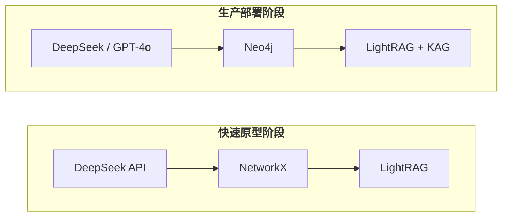
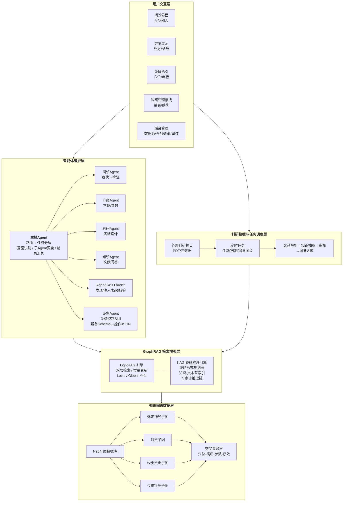
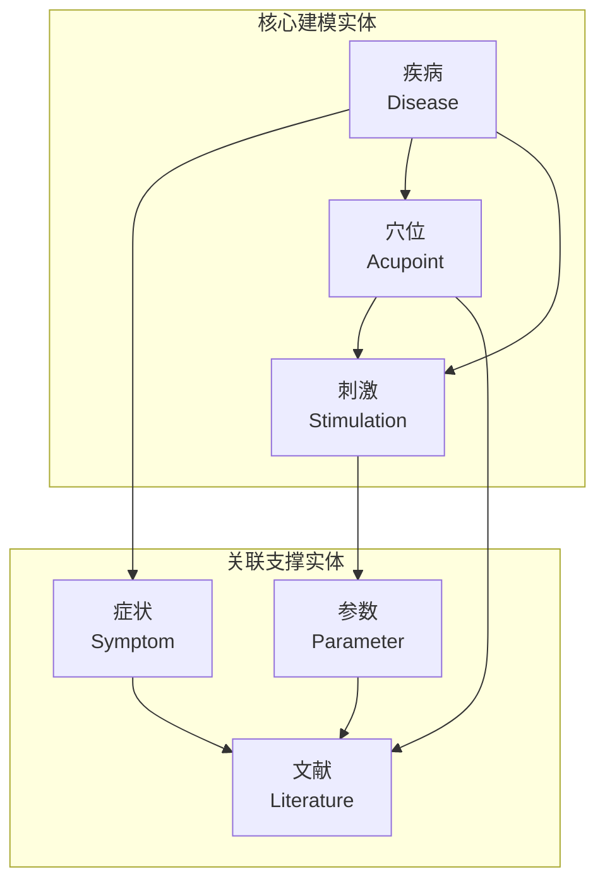
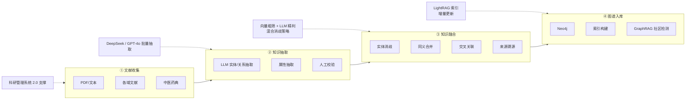
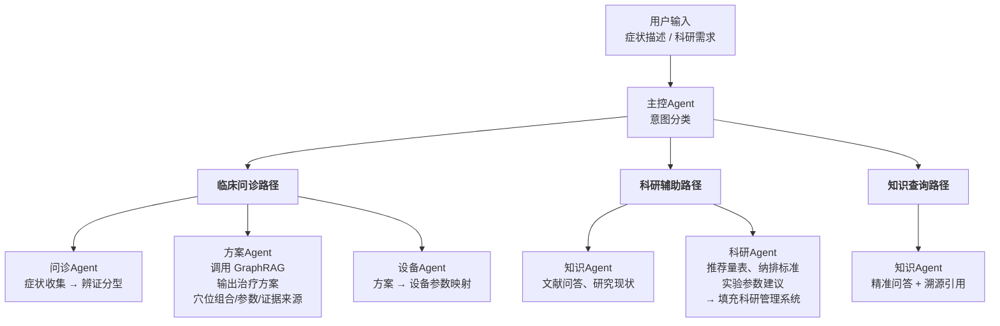

# GraphRAG 与知识图谱技术调研及框架设计

> 基于 2026年5月11日 最新开源生态调研
> 服务于"中医脑机接口智能体"项目

---

## 一、开源方案选型

### 1.1 GraphRAG 引擎对比

当前六大主流开源方案：

| 项目 | Stars | 开发方 | 定位 | 成熟度 |
|------|-------|--------|------|--------|
| **Microsoft GraphRAG** | 31k+ | 微软 | 全局社区摘要型 GraphRAG | ⭐⭐⭐⭐⭐ |
| **LightRAG** | 29k+ | 香港大学 (HKUDS) | 轻量级增量图结构 RAG | ⭐⭐⭐⭐ |
| **KAG (OpenSPG)** | 8k+ | 蚂蚁集团 / OpenKG | 逻辑推理型知识图谱 RAG | ⭐⭐⭐⭐ |
| **Youtu-GraphRAG** | 新发布 | 腾讯优图 | Schema 引导四层架构 | ⭐⭐⭐⭐ |
| **HippoRAG** | 3k+ | 俄亥俄州立大学 | 海马体记忆启发的联想检索 | ⭐⭐⭐ |
| **NebulaGraph** | 12k+ | vesoft | 分布式图数据库 + Fusion GraphRAG | ⭐⭐⭐⭐⭐ |

### 1.2 核心方案深度分析

#### Microsoft GraphRAG
- **机制**：LLM 提取实体/关系 → Leiden 社区检测分层聚类 → 生成社区摘要
- **检索模式**：
  - **Local Search**：针对特定实体的精细化推理
  - **Global Search**：宏观/总结性问题，检索社区摘要
  - **Drift Search**：融合全局与局部，动态选择相关社区
- **优势**：全局视野无可替代，适合对图谱精度要求高的场景
- **短板**：
  - Token 消耗极大（构建成本高）
  - 动态数据更新弱，增量困难
  - 仅原生支持 OpenAI API（社区已改进可本地部署）

#### LightRAG ⭐ 推荐首选
- **机制**：双层检索（低层精确匹配 + 高层语义匹配）+ 增量更新算法（新数据仅需并集操作，无需全量重建）
- **核心优势**（对比 Microsoft GraphRAG）：
  - 索引构建时间 **-60%**
  - 查询响应时间 **-70%**
  - Token 消耗 **-99.98%**（革命性降低）
  - 准确率 **+8~13%**
- **亮点**：集成 RAG-Anything，支持 PDF/DOCX/PPTX/图片/表格/公式
- **短板**：默认 Prompt 为英文，中文场景需重写 Prompt 模板；Drift 检索能力弱于 GraphRAG

#### KAG (OpenSPG)
- **机制**：基于 DIKW 层次结构的 LLMFriSPG 框架，逻辑形式驱动的检索推理，知识-文本块互索引
- **优势**：
  - 图节点与原始文本块深度锚定，可回溯证据
  - 逻辑形式规划器：复杂问题分解为规划/推理/检索步骤链
  - 知识对齐：语义推理消除歧义、识别同义实体
- **场景**：医疗、法律等需**可审计推理路径**的专业领域
- **契合度**：与本项目"专家系统需输出准确、可溯源方案"的需求高度匹配

#### 腾讯 Youtu-GraphRAG
- **机制**：Schema 引导的四层架构（属性层 → 关系层 → 关键词层 → 社区层）
- **优势**：构图成本节省 30%+，复杂推理准确率提升 16%+，原生支持中英双语
- **场景**：国产替代首选，跨领域迁移能力强

### 1.3 知识图谱构建工具

| 工具 | 特点 | 适用场景 |
|------|------|----------|
| **KGGen** (Stanford) | 多阶段流水线，迭代聚类消歧，NeurIPS 2025 | 高质量文献知识抽取 |
| **ATOM** (原 iText2KG) | 时序五元组抽取，并行流水线，延迟降低 95% | 动态时序 KG 构建 |
| **OpenTCM** | 专为中医设计，48,000+ 实体、152,000+ 关系，BIGCOM25 最佳论文 | **中医场景直接参考** |
| **ZhiFangDanTai** | GraphRAG + 微调 LLaMA，Neo4j + Leiden 社区检测 | 中医方剂推荐 |
| **llm2graph** | 纯 LLM 驱动，无启发式回退 | 快速原型验证 |

### 1.4 图数据库

| 数据库 | 定位 | 推荐场景 |
|--------|------|----------|
| **Neo4j** | 企业级图数据库，Cypher 查询，GDS 图算法库 | **生产环境首选** |
| **NetworkX** | Python 轻量图库 | 原型验证、小规模数据 |
| **NebulaGraph** | 分布式图数据库，万亿级边 | TB 级以上大规模部署 |

### 1.5 大模型选择

| 模型 | 适用环节 | 说明 |
|------|----------|------|
| **DeepSeek API** | 知识抽取 + 问答生成 | 中文能力强，性价比高 |
| **GPT-4o** | 知识抽取（高精度需求） | 抽取质量最好，成本较高 |
| **Qwen2.5-72B** | 本地部署全流程 | 中文原生支持，需 GPU 资源 |
| **Kimi API** | 长文本知识抽取 | 超长上下文，适合典籍批量处理 |

> **关键经验**：知识抽取环节，7B/14B 小模型效果很差，建议使用 ≥70B 模型或商业 API。

---

## 二、推荐选型方案

基于本项目特点（中医领域、需要可溯源推理、多知识域并行、学术+临床双场景），推荐**分层组合方案**：



### 选型理由

1. **LightRAG 作为主引擎**：支持增量更新（各知识域陆续添加文献时无需重建索引），Token 成本极低，适合学术场景的预算约束
2. **KAG 补充逻辑推理**：对外输出的治疗方案需要可审计的推理路径（谁问的、基于哪篇文献、什么证据等级），KAG 的逻辑形式引导机制最匹配
3. **Neo4j 作为生产存储**：成熟的图算法库（GDS）、Cypher 查询、可视化生态，适合知识图谱的持续维护和扩展
4. **DeepSeek API 作为主力模型**：中文知识抽取和问答能力强，成本可控
5. **OpenTCM 作为直接参考**：已有完整的中医知识图谱构建流程和 GraphRAG 问答实现，可大幅缩短开发周期

---

## 三、整体技术框架设计

### 3.1 系统全景架构



#### Agent Skill 与设备接入机制

这里的 Skill 指 **Agent Skill**：由 `SKILL.md`、脚本、模板和参考资料组成的能力包，供 Agent 在特定任务中读取并按步骤执行。设备控制只是其中一种 Skill；同一套机制还应覆盖文献抽取、图谱构建、科研方案生成、专家审核清单整理等任务。

设备Agent 通过设备控制 Skill 动态适配不同硬件设备：

```
设备端                          Agent 端（设备Agent）
──────                        ─────────────────────
1. 设备请求操作指令 ──────────→ 接收请求
                               │
                               ├─ 加载设备控制 Skill
                               ├─ 读取设备 Schema
                               ├─ 根据 Schema 生成操作 JSON
                               │  （穴位、频率、强度、时长等参数）
                               │
2. 设备接收 JSON ←─────────── 返回操作 JSON
3. 解析 JSON 并执行操作
4. 回传执行结果 ──────────────→ 记录执行状态 / 写入知识图谱
```

核心设计：
- Skill Registry 管理所有 Agent Skill 的 `SKILL.md`、版本、状态、权限和执行日志
- 每种设备接入时，注册设备 Schema（API 规范、参数范围、通讯协议），由设备控制 Skill 使用
- 设备向 Agent 发起请求时携带设备类型标识，Agent 路由到对应设备 Schema 生成符合该设备协议的操作 JSON
- 支持设备热插拔：新增设备仅需注册新的设备 Schema，并按需扩展设备控制 Skill，无需改动 Agent 主流程
- 可扩展至刺激器、脑电采集设备、电针仪等多类型硬件

### 3.2 知识图谱 Schema 设计

#### 核心实体类型



#### 核心关系类型

| 关系 | 头实体 | 尾实体 | 示例 |
|------|--------|--------|------|
| `TREATS` | 穴位组合/刺激方案 | 疾病 | "足三里+内关" TREATS "失眠" |
| `HAS_SYMPTOM` | 疾病 | 症状 | "抑郁症" HAS_SYMPTOM "入睡困难" |
| `MENTIONED_IN` | 实体 | 文献 | 所有实体指向其来源文献 |
| `HAS_PARAMETER` | 刺激方案 | 参数 | "迷走刺激方案A" HAS_PARAMETER "频率20Hz" |
| `RELATED_TO` | 耳穴 | 传统穴位 | "耳神门" RELATED_TO "神门穴" |
| `CONTRAINDICATED_FOR` | 方案 | 禁忌症 | "电针方案B" CONTRAINDICATED_FOR "妊娠" |

#### 属性设计（以"文献"实体为例）

```
Literature {
  title:        string      # 标题
  authors:      list        # 作者
  year:         int         # 发表年份
  journal:      string      # 期刊
  evidence_level: enum      # 证据等级 [RCT/系统综述/病例报告/专家意见]
  sample_size:  int         # 样本量
  doi:          string      # DOI
  abstract:     text        # 摘要
  full_text_ref: string     # 全文引用路径
}
```

### 3.3 知识图谱构建流程



### 3.4 智能体协作流程



### 3.5 技术栈总览

| 层级 | 技术选型 | 备注 |
|------|----------|------|
| 前端框架 | Vue 3 / React | 问诊界面、方案展示、设备指引可视化 |
| 后端框架 | Python FastAPI | 高性能异步 API |
| 智能体框架 | LangChain / LangGraph | 多 Agent 编排、工具调用 |
| GraphRAG 引擎 | LightRAG + KAG | 检索增强 + 逻辑推理 |
| 图数据库 | Neo4j | 生产级图存储与查询 |
| 向量数据库 | Milvus / Chroma | 嵌入检索（可选，LightRAG 内置） |
| 大模型 | DeepSeek API (主) / GPT-4o (备) | 知识抽取 + 问答生成 |
| 文档解析 | RAG-Anything / MinerU | PDF/文档多格式解析 |
| 科研管理集成 | 小梅 2.0 系统 API | 方案回填、文献管理 |

---

## 四、与已有中医 GraphRAG 工作的对接

### 4.1 OpenTCM（最直接参考）

- **论文**：[arXiv:2504.20118](https://arxiv.org/abs/2504.20118)（BIGCOM25 最佳论文）
- **代码**：[github.com/OpenTCM01/OpenTCM](https://github.com/OpenTCM01/OpenTCM)
- **核心资产**：从 68 本中医妇科典籍提取 373万+ 字，构建 48,000+ 实体、152,000+ 关系的多关系知识图谱
- **技术栈**：Python + Flask + NetworkX + Kimi/DeepSeek API
- **可直接复用**：
  - 中医知识图谱构建流水线
  - GraphRAG 问答系统架构
  - 中医实体/关系 Schema 设计经验

### 4.2 ZhiFangDanTai（智方丹台）

- **论文**：IEEE JBHI 2025
- **技术方案**：GraphRAG + LLaMA3.2-7B SFT/DPO 微调，Neo4j 存储
- **特色**：生成含君臣佐使、功效、禁忌症、舌脉诊的完整方剂
- **参考价值**：方剂生成的模式可类比本项目"穴位处方"的生成逻辑

### 4.3 中医药典知识图谱

- **数据集**：[OpenKG 中医药典](http://data.openkg.cn/dataset/chinesemedicinepharmacopoeia)
- **内容**：2022 版《中国药典》结构化知识图谱
- **用途**：可作为本项目的基础数据源之一，补充中药-经络-适应症关系

---

## 五、实施路径建议

### Phase 1：技术验证（第 1-2 周）

```
目标：跑通"文献→知识图谱→GraphRAG问答"最小闭环

1. 选取迷走神经刺激 500 篇文献中的 20-30 篇高水平论文
2. 使用 DeepSeek API 进行实体/关系抽取
3. 构建 NetworkX 原型知识图谱
4. 部署 LightRAG，测试 Local/Global 检索效果
5. 验证中文 Prompt 模板的问答质量
```

### Phase 2：Demo 搭建（第 3-4 周）

```
目标：完成可演示的专家系统原型

1. Schema 规范化设计（实体类型、关系类型、属性模板）
2. 切分知识域子图（迷走神经 / 耳穴 / 经皮穴电 / 针灸）
3. 接入 Neo4j（如条件允许）或继续 NetworkX
4. 实现问诊 → GraphRAG → 方案输出的 Demo 流程
5. 方案输出包含：推荐干预方式 + 证据来源 + 证据等级
```

### Phase 3：多域扩展（第 2 个月起）

```
目标：各知识域并行入库，系统稳定运行

1. 各学生按知识域并行提交结构化文献数据
2. LightRAG 增量更新，无需重建索引
3. 建立跨域关联（如耳穴 ↔ 传统穴位 ↔ 迷走神经位置）
4. 多 Agent 框架接入（问诊 Agent + 方案 Agent + 科研 Agent）
```

### Phase 4：设备集成（远期）

```
目标：方案输出直接驱动"终极盒"刺激设备

1. 建立治疗方案到设备参数的标准映射协议
2. 设备 Agent 实现参数自动转换
3. 闭环反馈：刺激效果回写知识图谱
```

---

## 六、关键风险与对策

| 风险 | 影响 | 对策 |
|------|------|------|
| 小模型知识抽取质量差 | 图谱不可用 | 使用 DeepSeek/GPT-4o 商业 API，≥70B 模型 |
| LightRAG 中文 Prompt 效果差 | 问答不准 | 参考 OpenTCM 的中文 Prompt 模板，自行改写优化 |
| 各知识域文献质量参差不齐 | 知识可信度低 | 仅纳入高水平文献（SCI/核心期刊），标注证据等级 |
| 中医领域需要专家校验 | 知识错误 | 与陆教授中医团队合作，建立人工校验流程 |
| Token 成本过高 | 预算超支 | LightRAG 成本极低（仅为 GraphRAG 的 0.02%），可控 |
