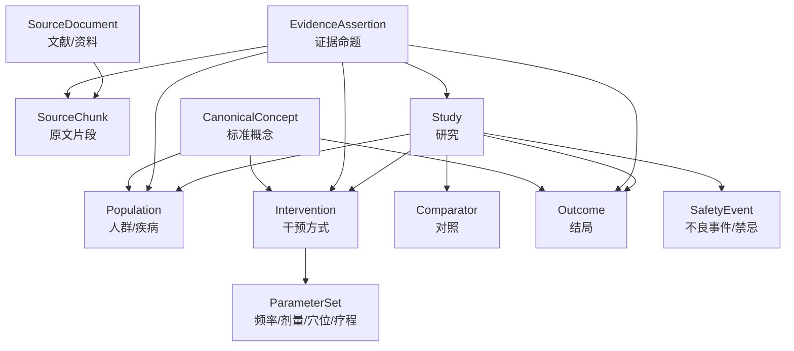
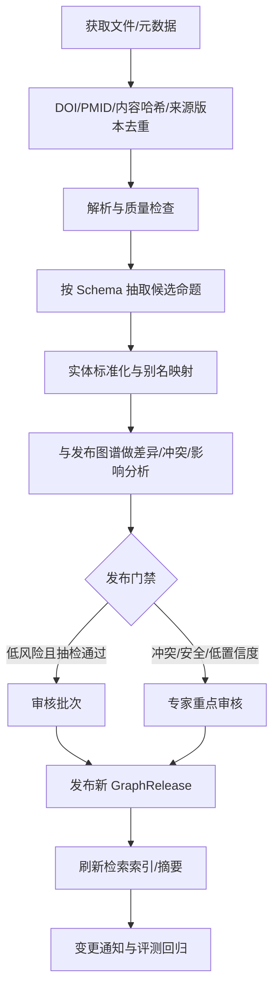
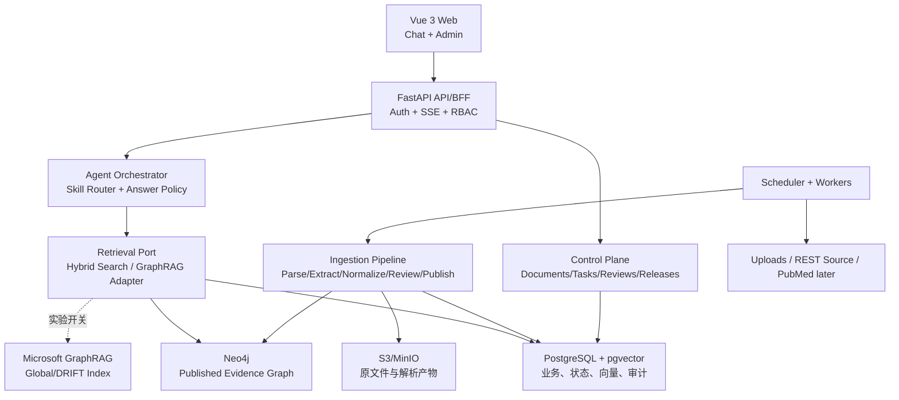

# 灵枢智衡 (LingShu Nexus) 基础版本产品化实施方案

> 文档状态：V1 实施建议稿  
> 编写日期：2026-05-23 | 最近修订：2026-06-03  
> 适用阶段：内部科研使用的第一个可交付产品版本（V1），以及向扩展领域、临床/设备或商用方向演进前的基础平台建设  
> 实施对象：供 Codex 在本仓库中逐步实现与校验，不作为团队排班或人员分工文档  
> 背景依据：[中医脑机接口项目-需求与技术整理.md](./中医脑机接口项目-需求与技术整理.md)、[GraphRAG与知识图谱技术调研及框架设计.md](./GraphRAG与知识图谱技术调研及框架设计.md)、[技术实施方案.md](./技术实施方案.md)、[针灸指南知识图谱优化方案-基于最新技术.md](./针灸指南知识图谱优化方案-基于最新技术.md)、[neuroskill_research.md](./neuroskill_research.md)、[请导师提供的项目资料清单（tVNS版本）.md](./请导师提供的项目资料清单（tVNS版本）.md)

---

## 0. 执行结论

### 0.1 V1 的产品定义

灵枢智衡 V1 不应被定义为“自动给出治疗并控制设备的系统”，而应被定义为：

> **面向内部科研使用的、以针灸为首个领域的可溯源证据知识平台：可批量导入 PDF/Markdown 科研论文及资料，抽取并审核证据三元组/命题，形成可持续更新的知识图谱；使用者通过带 Agent Skill 的流式对话检索、归纳并追溯证据；管理端管理文献、图谱、更新任务、Skill 与审计记录。平台的数据模型和接口需要支持后续增加其他领域，并为未来商用演进留出治理边界。**

这样定义并不是降低长期目标，而是先构建之后所有诊疗、实验设计和设备接入都会依赖的可信数据底座。

### 0.2 必须作出的产品决策

| 决策 | V1 结论 | 原因 |
|---|---|---|
| 首版知识范围 | 首域确定为**针灸**；领域隔离与 Schema 版本机制需允许后续新增其他领域 | 先完成一个可评价闭环，同时避免系统设计锁死在针灸 |
| 首批专业子场景 | 在 `acupuncture` 领域内优先纳入 tVNS/taVNS 文献、术语和问题集，不单独扩成设备控制或临床治疗模块 | 导师补充资料已给出真实语料方向、术语易错点和评测问题，可用于完善 Schema、词表和 evals |
| 用户输出 | 证据问答、文献归纳、研究线索与证据卡片 | 尚不把生成内容包装为诊疗处方或设备指令 |
| 图谱定位 | **证据图谱**，而非无来源的泛化实体关系网 | 每条医学相关结论必须能回溯到文献片段、抽取版本和审核状态 |
| GraphRAG 定位 | 可插拔的检索/总结能力，不是生产图谱的唯一主存储 | 微软 GraphRAG 索引适合检索和社区摘要，但不能替代领域主数据与审核流 |
| 自我更新 | “自动发现/抽取 + 人工或规则门禁发布 + 可回滚版本”的受控更新 | 医学证据不应由模型未经审批直接覆盖已发布知识 |
| Agent Skill | 提供有版本、权限、测试与审计的能力包 | 防止对话 Agent 任意写图、执行高风险操作 |
| 前台形态 | 网页流式对话，答案显式展示引用与 Skill | 满足首版使用体验，并为未来渠道复用同一 API |
| 管理面板 | 与对话能力同为 P0，不是后补功能 | 无审核、任务和审计界面就无法形成可信知识产品 |
| 实现策略 | 领域规则、审核发布和权限边界自有；解析、检索、任务、UI 等通用能力优先复用成熟组件 | 将研发投入留给决定产品可信度和差异化的部分 |
| 默认大模型 | 小米 MiMo 作为当前默认 provider，API key、base URL、model ID 均配置化 | 当前可直接推进，后续可无业务重写地切换模型 |
| 使用阶段 | V1 供内部科研使用，未来可能作为毕业设计成果并继续商用化 | 首版先满足科研可用性，仍需保留产品级质量和演进边界 |

### 0.3 对已有方案的关键修订

1. **不在 V1 同时上线临床问诊、治疗处方和设备控制。** 这些能力可在证据平台稳定、验证完成、专家和合规路径明确后扩展。
2. **不在立项阶段锁定 LightRAG + KAG 双引擎为生产依赖。** 它们可进入评测候选集，但 V1 先建立稳定的数据模型、检索接口和评测集。
3. **不让 GraphRAG 自动抽出的关系直接成为权威医学知识。** 抽取结果先进入候选层，由审核发布为可检索证据。
4. **不以“更多 Agent”代表产品成熟。** V1 只需要可解释的路由、少量高质量 Skill 和确定性的权限边界。
5. **不把“模块化”误解为从零开发每个模块。** 解析器、图检索库、后台组件、任务框架和可观测工具可以复用；平台只为它们增加领域模型、适配接口、质量门禁和可替换边界。

### 0.4 复用原则：组装产品，而不是堆积框架

V1 应采用“成熟组件 + 薄适配层 + 自有证据治理核心”的实现策略；Codex 实施时应先复用经验证的依赖和参考实现，再补足本项目确实需要拥有的能力：

| 类型 | 应优先采用的方式 | 示例 |
|---|---|---|
| 通用且非差异化能力 | 直接使用成熟工具或框架，不自行重写 | PDF 解析/OCR、对象存储、认证接入、任务执行、SSE、UI 表格表单、日志监控 |
| 会影响替换成本的基础设施 | 通过端口适配后接入，避免业务代码绑定实现 | 图数据库、向量搜索、LLM provider、GraphRAG 引擎、外部文献源 |
| 有多个成熟候选但效果依赖语料 | 用金标准集做短周期对比后再定默认方案 | Docling vs MinerU、hybrid retrieval vs GraphRAG、不同抽取模型 |
| 项目的核心价值与责任边界 | 必须由项目自己定义和维护 | Evidence Schema、候选/发布隔离、审核决策、图谱 release、Skill 权限、引用策略、质量评测 |

引入现有方案时使用三个判断条件：**是否降低真实交付成本、是否保留来源/审核/版本能力、是否可以在效果不好时替换**。不因为工具流行而硬接入，也不为展示工程量而重复造已有能力。

---

## 1. 产品定位与边界

### 1.1 长期愿景

项目长期愿景是将个体化评估、生理信号、证据知识图谱、干预建议和设备执行连接为闭环中医脑机接口平台。其知识域可覆盖迷走神经刺激（VNS）、耳穴、经皮穴位电刺激（TEAS）、传统针灸，并与科研管理系统、后续脑电/心电能力衔接。

### 1.2 当前必须先解决的问题

当前真正阻碍后续产品化的不是对话页面或设备 JSON，而是以下基础问题：

- 平台能否持续获取并正确解析文献；
- 图谱中的“结论”能否证明来自哪一篇文献、哪一段原文、哪个抽取/审核版本；
- 新证据进入后，能否知道哪些旧结论可能受影响；
- 模型回答是否只基于已发布证据，并在证据不足时明确停止推断；
- 学生、研究者、专家和管理员是否能在同一套后台完成协作与审计。

### 1.3 V1 范围

**包含：**

- 批量上传 PDF 和 Markdown，首域支持针灸科研论文及相关资料；
- 文献解析、分块、元数据登记、三元组/证据命题抽取；
- 候选图谱审核、发布、版本化和回滚；
- Neo4j 中的已发布证据图谱与向量/图混合检索；
- 可替换的 GraphRAG 检索适配层；
- 用户指定或模型选择的 Agent Skill；
- 网页端流式证据问答，包含引用、证据强度/审核状态说明；
- 管理面板：文献、任务、审核、图谱、Skill、用户/权限、审计与基础指标；
- 手动同步和配置化定时数据源同步；外部数据源允许返回 JSON 元数据、文件或二者组合；

**明确不包含：**

- 面向患者的诊断或个体治疗推荐；
- 自动生成可直接执行的刺激设备控制指令；
- 脑电/生理信号实时接入；
- 自动作出 GRADE 最终结论或指南推荐；
- 任意外部网站爬取、未确认授权的数据抓取；
- 多知识域一次性全面上线，但架构必须支持未来按 domain 增加知识域。

### 1.4 首个领域与扩展约束

首个领域已确定为**针灸**。导师补充资料显示，首批可评价语料可以优先围绕 tVNS/taVNS 研究展开；实现上仍归入 `acupuncture` 领域的专业子场景，不新建独立主流程，也不把 V1 扩展为设备控制或患者级治疗建议系统。实现时不再花时间比较 VNS/耳穴/TEAS 谁先上线，但仍需要用以下输入检查数据能否支撑首个可评价版本：

| 维度 | 实施输入/检查 |
|---|---|
| 可获取语料 | 用户已确认可以处理科研论文；开始实现时整理一批样例资料，其中逐步选出金标准集 |
| 审核能力 | 系统保留待审核、发布和回滚能力；实际审核人可由导师后续安排，不作为 Codex 搭建基础链路的阻塞项 |
| 概念边界 | 能列出疾病/症状、干预、参数、结局、安全事件的初始词表 |
| 评价问题 | 能提前写出至少 30 个真实查询及期望证据来源 |
| 数据更新源 | P0 具备人工上传；外部接口先以可配置连接器抽象处理，具体参数、JSON 或文件返回契约待获得样例后实现 adapter |

针灸不是全局硬编码：所有文档、Schema、图谱发布、检索索引、Skill 权限和评测数据都应关联 `domain_id`，首版使用 `acupuncture`。为兼容 tVNS/taVNS 等专业子场景，可增加 `topic_tags` 或 `scenario_id` 作为可选标签，用于评测集、术语表和检索过滤；后续如新增 VNS、耳穴、TEAS 或其他领域，不改写平台主流程。

### 1.5 tVNS/taVNS 专业补充

补充资料中与实现相关的内容应进入词表、Schema、抽取提示和评测集，而不是改变 V1 的核心实现链路：

- **术语标准化**：首批词表需要包含 `tVNS`、`taVNS`、`transcutaneous auricular vagus nerve stimulation` 及中文别名；耳部刺激位置重点校正 `耳甲艇` 对应 `Cymba Conchae`、`耳甲腔` 对应 `cavum conchae`/`concha cavity`/`cavity of auricular concha`、`耳屏` 对应 `tragus`。
- **疾病/症状语义**：`depression` 与 `blues` 不能简单合并；例如 `Postpartum blues` 应作为未达到抑郁症诊断水平但可能进展的情绪低落状态处理。
- **参数字段**：tVNS/taVNS 抽取除常规干预、对照、疗程外，还应保留干预剂量、刺激部位、频率、脉宽、强度、单次时长、总疗程、波形类型、sham/control 设置和安全监测信息。
- **安全字段**：禁忌症、不良反应、特殊人群排除标准、试验安全注意事项应作为重点审核字段；系统回答安全问题时必须给出处于已发布状态的来源。
- **证据质量**：文献可靠性先按来源质量信号辅助排序：专业数据库一区/二区、高被引、高热点论文优先，其次为数据库中其他论文；公众号或其他来源只能作为低优先级背景材料，不得单独支撑医学结论。
- **冲突处理**：不同论文结论不一致时，保留论文原始结论、适用条件和来源质量信号，不自动合并为单一结论。

---

## 2. 用户、场景与成功指标

### 2.1 V1 用户角色

| 角色 | 核心任务 | V1 权限 |
|---|---|---|
| 研究者/学生 | 上传资料、查询证据、查看图谱与引用、提交纠错 | 使用已发布图谱；上传进入待处理队列 |
| 领域审核专家 | 审核实体、关系、证据命题、冲突和术语映射 | 审核/退回/发布候选批次 |
| 平台管理员 | 配置数据源、任务、Skill、用户和系统参数 | 管理配置、回滚、查看全部审计 |
| 只读访客 | 查看获准展示的证据问答结果 | 只访问公开/内部只读空间 |

### 2.2 核心用户旅程

#### 旅程 A：建立首版知识库


#### 旅程 B：流式证据问答


#### 旅程 C：知识持续更新


### 2.3 V1 成功指标

| 类别 | 指标 | 首版验收目标 |
|---|---|---|
| 数据可用性 | 文字型 PDF/MD 解析成功率 | 在验收语料集上 >= 95%；失败文档有清晰原因与重试路径 |
| 溯源完整性 | 已发布关系/命题拥有原文引用与文档版本 | 100% |
| 审核治理 | 未审核候选内容进入用户答案 | 0 条 |
| 查询质量 | 金标准问题 Top-k 检索包含目标证据 | 先建立基线；上线门槛由专家在 30+ 问题集上签收 |
| 回答可信性 | 每个实质性医学陈述附已发布引用或明确说明证据不足 | 100% 抽检合规 |
| 更新可靠性 | 同一文件重复导入造成重复发布实体/命题 | 0 条严重重复 |
| 可运维性 | 每个流水线 run 可查看输入、阶段、耗时、错误与重跑结果 | 100% |
| 成本可控性 | 文档抽取、索引、查询的模型与 Token/费用统计 | 全量可追踪 |

---

## 3. 产品能力规划

### 3.1 P0：首版必须具备

| 模块 | 功能 | 用户可见结果 |
|---|---|---|
| 领域空间 | 创建领域、定义初始术语表与 Schema 版本 | 一个隔离的单领域知识空间 |
| 文献入库 | 批量 PDF/MD 上传、元数据编辑、哈希去重、解析状态 | 可追踪的文献清单 |
| 抽取流水线 | 分块、结构化抽取、实体标准化、候选命题生成 | 待审核批次与原文对照 |
| 审核发布 | 批准/驳回/修订、冲突标记、批次发布、回滚 | 版本化已发布图谱 |
| 检索问答 | 流式聊天、Skill 指定/自动选择、引用展开 | 带证据来源的回答 |
| 管理台 | 文献、任务、审核、图谱浏览、Skill、配置、日志 | 可操作的日常工作台 |
| 更新任务 | 人工同步、一个可配置外部接口适配器、定时运行；适配 JSON 或文件型响应 | 增量候选更新 |
| 权限审计 | 登录、RBAC、审计记录、敏感配置保护 | 可追责的操作记录 |

### 3.2 P1：V1 稳定后优先加入

| 能力 | 加入条件 |
|---|---|
| PubMed/Crossref 标准数据源连接器 | 已完成内部资料导入闭环，且明确全文获取权限 |
| Microsoft GraphRAG global/DRIFT 主题概览实验 | 基础检索评测已建立，可量化其增益与成本 |
| 冲突证据提醒与“哪些回答可能变化”影响分析 | 已存在至少两个发布版本 |
| 专题报告导出、科研管理系统回填 API | 确定外部系统接口契约 |
| 扫描版 PDF/OCR、复杂表格抽取增强 | 失败文档占比证明值得投入 |

### 3.3 P2：另行立项和风控评估

| 能力 | 前置条件 |
|---|---|
| 个体化临床方案辅助 | 专家验证集、安全规则、适用范围、合规路径和责任边界明确 |
| 设备控制 Skill | 设备协议、硬限制、人工确认、实验伦理/安全流程均具备 |
| 生理信号/BCI 接入 | 隐私、数据加密、研究验证和数据治理方案完成 |

---

## 4. 知识图谱：从“三元组”升级为“可审核证据命题”

### 4.1 为什么不能只保存普通三元组

`(耳穴刺激) -[TREATS]-> (失眠)` 这样的关系缺少人群、比较对象、干预参数、结局、证据来源和冲突信息。它可以用于展示关联，但不应直接支撑研究结论，更不能支撑治疗建议。

V1 仍支持抽取三元组用于概念关系导航，但核心数据对象应是**证据命题（Evidence Assertion）**：一条带来源、适用条件、结局和审核状态的可版本化陈述。

### 4.2 建议的领域模型



### 4.3 核心对象

| 对象 | 用途 | 关键字段 |
|---|---|---|
| `SourceDocument` | 原始资料与版权/来源管理 | `id`, `domain_id`, `topic_tags`, `title`, `doi/pmid`, `source_uri`, `content_hash`, `file_version`, `license_note`, `source_quality_tier` |
| `SourceChunk` | 可点击定位的引用单位 | `document_id`, `page/heading`, `text`, `parser_version`, `embedding_version` |
| `Study` | 研究级记录 | `study_type`, `publication_date`, `population_summary`, `risk_of_bias_status`, `journal_quartile`, `citation_count`, `region_or_team` |
| `CanonicalConcept` | 实体标准化 | `type`, `preferred_name`, `aliases`, `external_code`, `status` |
| `EvidenceAssertion` | 可检索、可审核结论 | `subject`, `predicate`, `object`, `population`, `parameter_set`, `outcome`, `direction`, `source_chunk_ids`, `extraction_confidence`, `review_status`, `source_quality_signals`, `valid_from`, `supersedes` |
| `ReviewDecision` | 审核与修订记录 | `reviewer`, `decision`, `reason`, `before/after`, `timestamp` |
| `GraphRelease` | 面向用户的发布版本 | `version`, `included_batch_ids`, `schema_version`, `index_version`, `released_by` |

### 4.4 Schema 设计原则

- **先来源，后关系**：没有来源片段的候选命题不得发布。
- **保留冲突**：新证据与旧证据矛盾时并列保存，标记冲突和适用条件，不覆盖删除。
- **区分事实与推荐**：文献报告的观察/效果是 evidence assertion；系统生成的总结或建议是 derived output，二者不可混存。
- **版本不可变**：原始文件、解析文本、抽取 JSON、审核决策和发布版本都保留不可变记录；纠正通过新版本表达。
- **术语表配置化**：领域特有实体、关系、枚举和映射存放于版本化 Schema/词表，不写死在 Prompt 中。
- **证据质量只辅助排序**：期刊分区、引用量、热点标记和来源类型用于排序、筛选和审核提示，不自动替代人工审核，也不自动生成最终证据等级。
- **专业子场景可标记**：tVNS/taVNS 等子场景通过 `topic_tags`、词表版本和评测集绑定，不要求改变主 `domain_id`。

### 4.5 候选抽取输出示例

```json
{
  "document_id": "doc_001",
  "chunk_refs": ["doc_001:p5:chunk_03"],
  "assertions": [
    {
      "subject": {"type": "Intervention", "text": "经皮迷走神经刺激"},
      "predicate": "AFFECTS_OUTCOME",
      "object": {"type": "Outcome", "text": "睡眠质量评分"},
      "context": {
        "population": "原文提取的人群描述",
        "parameters": "原文提取的刺激参数",
        "comparator": "原文提取的对照",
        "direction": "improved|no_difference|worsened|unclear"
      },
      "evidence_quote": "仅保存合规长度的定位片段或定位信息",
      "confidence": 0.86,
      "review_status": "pending"
    }
  ],
  "extractor": {
    "model": "configured_model_id",
    "prompt_version": "extraction-v1.0.0",
    "schema_version": "acupuncture-tvns-v0.1.0"
  }
}
```

---

### 4.6 tVNS/taVNS 抽取重点

首批 tVNS/taVNS 资料进入系统时，抽取器和审核页至少要能暴露以下字段，避免专业场景中常见信息丢失：

| 类别 | 字段/概念 | 说明 |
|---|---|---|
| 刺激位置 | `cymba_conchae`, `cavum_conchae`, `tragus` 及中文/英文别名 | 需要别名归一，保留原文写法，防止耳甲艇/耳甲腔误译 |
| 刺激参数 | 频率、脉宽、强度、波形、单次时长、疗程、总剂量 | 对应导师问题中的“干预剂量”和“刺激参数” |
| 研究设计 | RCT、分组、sham/control 设置、纳排标准、样本量 | 用于回答通用 RCT 设计和研究方案问题 |
| 结局指标 | 行为学量表、电生理、影像学、生化检测指标 | 用于区分疗效评价类型和机制证据 |
| 安全信息 | 禁忌症、不良事件、特殊人群、试验注意事项 | 发布前重点审核，回答时必须引用 |
| 机制信息 | 适应症、作用通路、疾病领域、研究地区/团队 | 用于机制归纳、领域差异和趋势问题 |

这些字段不要求所有文献都完整存在；缺失时应以 `unknown` 或空值表示，并在回答中说明证据不足。

---

## 5. 受控自我更新：Living Evidence Pipeline

### 5.1 产品定义

知识图谱“支持自我更新”应落实为：

> 系统自动发现新资料、识别重复或变更、解析和抽取候选知识、评估对已发布结论的潜在影响；发布到生产图谱前执行规则校验与分级审核；每次发布都可追溯和回滚。

这与 living systematic review 的持续监测思想一致，但系统只辅助证据维护，不代替专家作出最终医学证据等级或指南推荐判断。

### 5.2 更新分层

| 层 | 存放内容 | 是否供聊天检索 | 写入方式 |
|---|---|---|---|
| Raw 原始层 | 上传文件、外部接口响应、文件哈希、许可说明 | 否 | 仅追加，不修改原件 |
| Parsed 解析层 | Markdown/结构化块、页码/标题定位、解析日志 | 否 | 可按解析器版本重新生成 |
| Candidate 候选层 | 实体、三元组、证据命题、冲突检测结果 | 默认否 | 自动抽取，等待审核 |
| Published 发布层 | 审核通过的命题、概念映射、图谱版本 | 是 | 审核批准的 release 才更新 |
| Derived 派生层 | 社区摘要、向量索引、评测结果、缓存 | 是，但标识派生版本 | 随发布版本重建或增量刷新 |

### 5.3 触发策略

| 触发类型 | V1 策略 | 后续策略 |
|---|---|---|
| 人工上传 | P0，支持批量 PDF/MD | 保持 |
| 外部资料接口 | P0 先提供 connector 配置、原始响应留存和定时规则；获得样例后实现 JSON 元数据/文件下载 adapter | 增加多个渠道与字段映射模板 |
| PubMed 元数据发现 | P1，通过 NCBI E-utilities 按检索式和日期窗口拉取 | 增加变更提醒和全文授权接入 |
| DOI/出版元数据补全 | P1，通过 Crossref REST API 使用更新时间窗口与游标同步 | 保持 |
| CNKI/其他受限全文渠道 | 仅在获得接口和授权契约后接入 | 依据许可实施 |

### 5.4 增量更新算法与门禁



**幂等键：**

- 文件级：`source + external_id + content_hash`；
- 文献级：优先 `doi` 或 `pmid`，否则规范化标题、年份与作者哈希；
- 命题级：`canonical_subject + predicate + canonical_object + context_hash + source_chunk_id`；
- 任务级：`data_source_id + window_start + window_end + cursor`。

**外部接口未定时的实现约束：**

- 不预设外部接口一定返回统一文献 JSON；`SourceConnector` 输出统一的内部 `SourceArtifact`，其原始载荷可为 JSON、PDF/MD 文件或文件下载引用。
- 管理面板先允许配置 `base_url`、认证、请求模板、调度规则和响应模式；字段映射/文件获取规则在拿到真实样例后按 connector 添加。
- 原始响应或下载文件必须先进入 Raw 层，失败响应与解析错误可查看、可重跑，防止未来接口变化时丢失排查依据。

**必须进入专家重点审核的变化：**

- 出现与当前已发布结论方向相反的新命题；
- 涉及禁忌、不良事件、参数安全范围或特殊人群；
- 系统试图把低质量/无法定位来源的材料用于结论；
- 未来涉及治疗建议、设备参数或临床用户可见结论的任何变化。

### 5.5 发布与回滚

- 每次发布生成 `GraphRelease`，固定包含文档版本、Schema、Prompt、模型、审核人和索引版本。
- 对话默认只访问一个标记为 `active` 的发布版本，管理员可在测试空间对比新旧版本。
- 新版本发布前自动运行固定问题集，比较引用变化、无依据回答和检索退化。
- 若新版本引发错误，切换 active release 回滚；不得通过手动删除图中部分节点来“修复线上”。

---

## 6. Agent Skill 产品设计

### 6.1 Skill 的定位

Agent Skill 是带有说明、资源、工具权限、输入输出契约和版本状态的能力包。它解决的是“模型在特定任务中如何按平台规范工作”，而不是用自然语言绕过后端权限系统。

V1 的 Skill 分为两类：

| 类别 | 例子 | 是否可由普通聊天直接执行 |
|---|---|---|
| 只读查询 Skill | `evidence-query`, `literature-summary`, `research-gap-analysis` | 是，仅访问已发布证据 |
| 后台工作 Skill | `document-extraction`, `graph-review-assistant`, `source-sync` | 否，由有权限用户在管理台启动 |

写图、发布、任务配置和未来设备控制必须通过服务端权限与审核流，不能仅凭 `SKILL.md` 指示由对话模型完成。

### 6.2 用户指定与模型自动选择

| 模式 | 交互 | 规则 |
|---|---|---|
| 用户指定 | 对话栏选择 Skill，或命令式指定 | 若无权限或输入不符合契约，拒绝执行并说明 |
| 自动选择 | Agent 只在已启用、用户有权使用的只读 Skill 中路由 | 返回中展示实际使用的 Skill 名称与版本 |
| 无匹配 | 使用普通证据检索或提示用户选择能力 | 不猜测调用高风险 Skill |

### 6.3 Skill 包结构

```text
skills/
└── evidence-query/
    ├── SKILL.md
    ├── registry.yaml              # 平台扩展：服务端权限与发布信息
    ├── references/
    │   ├── output-schema.json
    │   └── citation-policy.md
    ├── templates/
    │   └── answer-prompt.md
    └── tests/
        └── cases.yaml
```

为兼容 Agent Skills 规范，`SKILL.md` 本身必须带 `name` 与 `description` frontmatter。平台另外用 `registry.yaml` 保存由后端强制执行的角色、scope、checksum 和启停信息；不能依赖规范中仍属实验性的 `allowed-tools` 字段承担安全授权。

```markdown
---
name: evidence-query
description: Query approved evidence and return traceable citations. Use for research questions about the active domain corpus.
metadata:
  lingshu-version: "0.1.0"
---

# Evidence Query

Use only published evidence available through the permitted retrieval tool. Cite source chunks and state limitations.
```

```yaml
# registry.yaml - 由平台服务端校验和执行
skill_id: evidence-query
version: 0.1.0
status: active
scope: read_only
server_allowed_tools:
  - published_graph_search
  - source_chunk_fetch
minimum_role: researcher
checksum: generated_on_publish
```

### 6.4 生命周期与审计


每次执行至少记录：

- 会话/任务 ID、调用人、领域空间；
- Skill ID 与版本、路由原因（用户指定或自动选择）；
- 检索条件、访问的发布图谱版本和引用文档 ID；
- 模型/Prompt 版本、耗时、Token/成本；
- 输出安全检查结果与用户反馈。

### 6.5 V1 首批 Skill

| Skill | 目标 | 依赖 |
|---|---|---|
| `evidence-query` | 针对明确问题检索已发布证据并生成引用式回答 | 图谱检索、来源片段 |
| `literature-landscape` | 汇总当前领域的研究主题、干预/结局分布与证据空白 | 图聚合、可选 GraphRAG 摘要 |
| `document-extraction` | 在后台将新文献解析结果转换为候选证据 | 抽取模型、Schema 校验 |
| `review-assistant` | 把候选命题、原文和冲突并排呈现给专家 | 审核接口；不得自动批准 |

---

## 7. 网页流式对话

### 7.1 交互原则

- 对话回答必须区分“文献中报告的内容”“系统归纳”和“证据不足/未审核”。
- 引用必须可点击定位至文献、页面/标题和片段；无引用的医学断言不得作为最终回答输出。
- 默认只检索 active 发布版本，候选知识只能在管理台预览。
- 用户能够看到本次使用的 Skill、图谱版本、检索范围与生成时间。
- 面向研究者使用明确的研究辅助声明，不表现为临床诊断或治疗指令工具。

### 7.2 前台页面

| 页面 | 主要内容 | P0 |
|---|---|---|
| `/chat` | 会话列表、流式回答、Skill 选择、引用侧栏、反馈按钮 | 是 |
| `/sources/:id` | 文献元数据、解析内容、引用定位、关联已发布命题 | 是 |
| `/graph` | 从概念或命题查看局部关联图、筛选来源/版本 | 是 |
| `/reports` | 专题摘要或导出任务 | 否，P1 |

### 7.3 回答输出契约

每次答案的结构化响应应支持：

```json
{
  "conversation_id": "conv_id",
  "answer_markdown": "streamed text",
  "skill": {"id": "evidence-query", "version": "0.1.0"},
  "graph_release": "vns-2026.06.1",
  "citations": [
    {
      "document_id": "doc_id",
      "chunk_id": "chunk_id",
      "locator": "page/section",
      "assertion_ids": ["assertion_id"]
    }
  ],
  "limitations": ["当前检索范围仅覆盖已审核文献"],
  "trace_id": "trace_id"
}
```

### 7.4 传输方案

V1 对话采用 **HTTP + Server-Sent Events (SSE)** 输出 token、检索阶段和引用事件。理由是首版主要是服务端向浏览器单向流式推送，连接模型简单、易于经过网关和记录审计。未来设备状态或实时生理信号若需要持续双向连接，再独立引入 WebSocket 通道。

---

## 8. 管理面板

### 8.1 P0 信息架构

| 模块 | 核心功能 | 关键操作 |
|---|---|---|
| 总览 | 文献数、待审数、发布版本、失败任务、查询质量/成本 | 跳转到待处理事项 |
| 领域与 Schema | 领域空间、实体/关系/词表、版本 | 创建草稿、发布 Schema |
| 文献库 | 上传、来源、哈希、许可备注、处理状态、引用定位 | 批量上传、重跑解析、停用资料 |
| 任务中心 | 同步/解析/抽取/索引任务和 schedule | 立即执行、暂停、重试、查看日志 |
| 审核工作台 | 候选命题与原文对照、标准化建议、冲突 | 批准、修订、驳回、重点标记 |
| 图谱版本 | 发布批次、变更 diff、回归评测、active 版本 | 发布、回滚、对比 |
| Skill Registry | 内容、版本、权限、样例测试和执行记录 | 上传、校验、启用、禁用、回滚 |
| 用户与审计 | 角色、操作日志、模型成本、配置变更 | 授权、导出审计 |

### 8.2 权限矩阵

| 操作 | 研究者 | 审核专家 | 管理员 |
|---|---:|---:|---:|
| 查询已发布知识 | 是 | 是 | 是 |
| 上传资料 | 是 | 是 | 是 |
| 查看候选抽取 | 自己上传/授权域 | 是 | 是 |
| 审核候选命题 | 否 | 是 | 可配置 |
| 发布/回滚图谱 | 否 | 建议权 | 是，需二次确认 |
| 编辑 Schema/词表 | 提议 | 审核 | 发布 |
| 管理数据源与 schedule | 否 | 否 | 是 |
| 启用后台写操作 Skill | 否 | 否 | 是 |

---

## 9. 技术架构与选型建议

### 9.1 目标架构



### 9.2 组件复用与参考实现地图

平台不需要自行实现 PDF 版面分析、通用向量检索算法、任务队列或后台基础控件。建议先选一个最短可用组合完成闭环，对效果敏感的部分再用金标准集比较替换。

| 产品能力 | 优先复用/参考的候选 | 平台仍需自行实现的部分 | 引入方式 |
|---|---|---|---|
| PDF/版面解析 | Docling 作为首个适配器；复杂中文扫描/公式表格语料用 MinerU 对比 | 文档版本、chunk 定位契约、解析质量状态和失败重跑 | `DocumentParser` adapter，先用金标准 PDF 小样本实测 |
| Markdown 入库 | 标准 Markdown 解析库 | 标题/段落到引用 locator 的稳定规则 | 直接使用，不引入 AI 解析 |
| 图存储与基础 GraphRAG | Neo4j 与官方 Neo4j GraphRAG for Python | Published Evidence Schema、release 隔离、审核过滤和引用输出 | 作为首个图检索 baseline 封装到 `RetrievalPort` |
| 主题级 GraphRAG | Microsoft GraphRAG；LightRAG 可作为轻量/增量候选参考 | 只把 approved release 喂给派生索引，记录索引版本与回归结果 | 在检索基线存在后按需试验，不阻塞 V1 主链路 |
| 复杂知识推理 | KAG 的专业域知识推理思路与实现 | 医学结论发布门禁和可解释输出策略 | P1/P2 只有在复杂问题评测证明需要时接入 |
| 结构化抽取 | 模型供应商结构化输出能力或成熟 SDK + Pydantic/JSON Schema 校验 | Evidence Schema、Prompt、字段溯源、置信度和审核批次 | 可替换 `EvidenceExtractor`，不要自造模型调用框架 |
| Agent Skill | Agent Skills 的 `SKILL.md` 结构规范 | Registry、RBAC、发布状态、执行日志和写操作限制 | 规范复用，治理层自有 |
| 工作流/任务 | Celery + Redis/Celery Beat；复杂长流程再评估 Temporal | 幂等键、任务状态、人工审核节点和补偿规则 | 不自行实现队列或 scheduler |
| 管理台 UI | Vue 生态成熟组件库或合适的 admin shell | 本项目审核工作台、图谱 diff、引用定位交互 | 在现有前端方向和许可证核验后选择，不硬套模板 |
| 登录与权限 | 已有机构 SSO/OIDC 优先；无可用身份源时再选择成熟认证方案 | 业务角色、领域授权、审计和高风险二次确认 | 不自行实现密码安全体系 |
| 可观测性 | OpenTelemetry 接口以及适配部署环境的日志/错误/指标工具 | 业务事件、质量评测与模型成本字段 | 从首个可运行版本开始接入最小链路 |
| 外部文献发现 | NCBI E-utilities、Crossref REST API 或已有科研接口 | 来源授权、去重、同步窗口和发布门禁 | 每类来源独立 `SourceConnector` |

**复用边界：**

- 可参考开源项目的数据处理流程、Prompt 组织、检索方式和 UI 交互，但导入前需要核验许可证、维护活跃度、数据安全和本项目语料效果。
- 第三方 GraphRAG 或解析器产出的数据一律进入 candidate/derived 层；`Published Evidence Graph` 只能由平台的审核发布流程生成。
- 若某现成组件已经满足端口契约和质量要求，不再为“统一风格”额外重写一套功能。
- 若工具引入需要同时部署多套数据库或维护重复索引，必须用评测收益说明其必要性。

### 9.3 推荐技术栈

| 层 | V1 推荐 | 决策理由 |
|---|---|---|
| Web | Vue 3 + TypeScript + Vite + 经许可核验的成熟组件库 | 延续已有方案；表单、表格、上传、权限菜单等通用 UI 不从零开发 |
| API | FastAPI + Pydantic | Python AI/解析生态直接，适于 SSE 和结构化契约 |
| 事务与审计 | PostgreSQL + SQLAlchemy + Alembic | 文献状态、审核、任务、版本、权限必须由事务库管理 |
| 向量搜索 | `pgvector` 起步 | 减少独立 Chroma 服务；规模或性能证明需要后再迁移 |
| 文件存储 | S3 兼容存储，开发用 MinIO | 保留原始文件与不可变解析产物，便于版本化与部署 |
| 图数据库/图检索 | Neo4j + 优先验证官方 GraphRAG Python 能力 | 复用成熟图存储和 retriever；平台维护审核后的证据模型与版本 |
| 解析器 | `DocumentParser` 接口下复用 Docling；中文复杂/扫描 PDF 与 MinerU 比测 | 不自建 OCR/版面算法；Markdown 走确定性解析 |
| 抽取/生成 LLM | Provider adapter；默认配置小米 MiMo，structured output + 强 JSON Schema 校验 | `MIMO_API_KEY`、base URL、model ID 通过配置注入；后续换模型无需修改业务用例 |
| 异步任务 | Celery + Redis/Celery Beat，并以 PostgreSQL `job_run` 为权威状态 | 复用成熟队列与调度能力，同时保证业务幂等、可重跑、可观测 |
| 长流程升级 | 出现多日人工等待、复杂补偿或高 SLA 后评估 Temporal | 避免基础版过早承担额外运维面 |
| Agent 编排 | 轻量状态机/服务层先行；若多路径复杂化再使用 LangGraph | 首版路由不需要为了框架而拆成过多 Agent |
| 鉴权 | 对接既有 OIDC/SSO 优先 + 业务 RBAC + 审计日志 | 不重造登录安全能力；后台发布与数据源凭据仍由平台管控 |
| 可观测性 | 结构化日志 + OpenTelemetry 接口 + 模型成本事件 | 复用监控生态，并保留产品关键质量指标 |
| 部署 | Docker Compose 开发/演示；预留容器化生产配置 | 快速一致环境，后续可转托管数据库/容器平台 |

### 9.4 GraphRAG 选型结论

“使用 GraphRAG”不等于让某个开源索引引擎拥有全部数据职责。建议按以下方式落地：

| 能力 | V1 落地方式 | 说明 |
|---|---|---|
| 权威知识图谱 | 自有领域 Schema + Neo4j Published Evidence Graph | 持久保存审核后的证据命题和来源 |
| 基础检索 | 优先封装 Neo4j GraphRAG for Python 提供的合适 retriever，并叠加发布版本/引用过滤；必要时补充 `pgvector` | 复用现有实现，同时保持回答可追溯 |
| GraphRAG 接入 | 以 `GraphRAGRetriever` 端口接入 Neo4j 官方包或经评测胜出的候选 | 不增加第二份权威数据，也不把实现写死 |
| 全局主题总结 | 对已发布片段离线试验 Microsoft GraphRAG global/DRIFT | 微软文档提供 `index`/`update` 和 local/global/DRIFT 查询；以质量/成本评测决定上线 |
| LightRAG/KAG | 作为后续 benchmark 候选，不作为 V1 强依赖 | LightRAG 的插入/删除与存储能力、KAG 的推理能力都值得测试，但不应无本项目数据就作生产承诺 |

**重要边界：** Microsoft GraphRAG 的索引产物与更新流程可以支持派生检索索引更新，但产品仍需自行管理原始文献、审核状态、发布版本、Schema 和回滚。

### 9.5 为什么修订已有技术选型

| 既有设想 | 建议修订 | 工程原因 |
|---|---|---|
| LightRAG + KAG 首版双引擎 | 首版优先复用一套成熟检索 baseline，通过接口封装后再做候选实测 | 多引擎会立即带来双份索引、调试和一致性问题 |
| Chroma 为默认向量库 | 小规模首版使用 PostgreSQL + pgvector | 减少服务数和备份/权限/状态一致性成本 |
| 一开始多 Agent 协作 | 首版只保留 Skill Router + Answer Policy + 后台流水线 | 用户价值来自可信证据，不来自 Agent 数量 |
| 自动 GRADE 判定 | 只提供结构化字段提取和审核辅助 | GRADE 涉及方法学判断，不能直接由模型定论 |
| 自动控制设备 | 进入 P2 独立风控路线 | 设备执行将研究辅助升级为安全关键系统 |

---

## 10. 模块化代码结构建议

建议采用单仓多应用结构，业务边界由领域模块和端口接口体现，而不是按页面散落：

```text
lingshu-nexus/
├── apps/
│   ├── api/                       # FastAPI 启动、REST/SSE、认证装配
│   ├── worker/                    # Celery workers 与定时任务
│   └── web/                       # Vue 对话端 + 管理台
├── packages/
│   ├── domain/                    # 领域对象、状态机、Schema、发布规则
│   │   ├── documents/
│   │   ├── evidence/
│   │   ├── reviews/
│   │   ├── releases/
│   │   └── skills/
│   ├── application/               # 用例服务，不依赖具体数据库/模型厂商
│   ├── ports/                     # Parser/Extractor/Graph/Retrieval/LLM/Storage/Source 接口
│   ├── adapters/
│   │   ├── parsers/               # 复用 Docling/MinerU 的适配器 + Markdown 定位
│   │   ├── extractors/            # LLM structured output 适配 + JSON 校验
│   │   ├── storage/               # Postgres、Neo4j、S3/MinIO、pgvector
│   │   ├── retrieval/             # Neo4j GraphRAG baseline、hybrid 补充、候选实验
│   │   └── sources/               # upload、REST、PubMed/Crossref 客户端适配
│   └── observability/             # 日志、metrics、trace、cost
├── skills/                        # 版本化 Skill 源内容和测试样例
├── schemas/                       # 领域 Schema、词表、JSON Schema
├── evals/                         # 金标准文档、问题、抽取与回答评测
├── deployments/                   # compose、迁移、环境样例
└── docs/                          # ADR、API、操作说明与发布记录
```

### 10.1 必须存在的端口接口

| 接口 | 职责 | 首版实现 |
|---|---|---|
| `DocumentParser` | 文件转结构化 chunks，并保留定位 | 确定性 Markdown parser + Docling adapter；失败样例决定是否接 MinerU |
| `EvidenceExtractor` | 按 Schema 生成候选对象 | 模型 structured output adapter + Pydantic/JSON Schema 验证 |
| `ConceptNormalizer` | 别名映射、实体候选合并 | 词表 + 审核辅助 |
| `GraphRepository` | 发布图谱的读写与版本绑定 | Neo4j adapter |
| `RetrievalService` | 对话检索统一入口 | Neo4j GraphRAG baseline adapter；可替换/补充 hybrid 或其他 GraphRAG |
| `SkillRegistry` | 发现、启停、权限、版本与测试 | Postgres + 文件/对象存储 |
| `SourceConnector` | 人工/接口来源同步 | upload + generic REST |
| `ReleaseService` | 发布、回滚、差异与回归门禁 | Postgres ledger + Neo4j release binding |

### 10.2 配置原则

- 领域 Schema、术语词表、抽取 Prompt、Skill 和评测集均版本化；
- 模型、embedding、解析器、检索方式、数据源 schedule 通过配置切换；
- secrets 不进入文档、Skill 或数据库明文字段；
- 配置变更也写入审计记录，并关联到后续生成的数据批次。
- 引入的开源库/参考项目记录版本、许可证、用途、替换路径与已知限制，避免无意识 fork 或长期锁定。

当前模型配置建议以 provider adapter 形式表达，默认启用 MiMo，不在业务代码中硬编码密钥或具体模型版本：

```yaml
llm:
  provider: mimo
  base_url: ${MIMO_BASE_URL}
  api_key: ${MIMO_API_KEY}
  model: ${MIMO_MODEL_ID}
  extraction_model: ${MIMO_EXTRACTION_MODEL_ID} # 未配置时由应用回退到 model
  chat_model: ${MIMO_CHAT_MODEL_ID}             # 未配置时由应用回退到 model
```

若之后切换到其他模型供应商，只新增或替换 provider 配置与 adapter，并通过既有抽取/问答评测集验收，不修改 Evidence Schema、审核流或 Skill 契约。

### 10.3 复用组件的准入清单

任何进入主链路的第三方组件至少回答以下问题：

| 检查项 | 通过标准 |
|---|---|
| 功能契合 | 能通过端口契约满足当前用例，不要求大规模改写业务 |
| 质量 | 在本领域金标准语料或问题集上有可复现结果 |
| 可溯源性 | 不丢失原始文档、chunk locator、release 或引用关系 |
| 许可证与数据条款 | 允许项目预期使用方式，云服务符合文献与敏感数据约束 |
| 运维负担 | 部署、升级、备份与故障定位成本在项目可接受范围内 |
| 替换性 | 能通过 adapter 替换，不把 Schema/审核发布逻辑嵌入第三方内部 |

---

## 11. 数据状态与 API 契约

### 11.1 文献流水线状态

```text
UPLOADED
  -> DEDUP_CHECKED
  -> PARSED | PARSE_FAILED
  -> EXTRACTED | EXTRACTION_FAILED
  -> NORMALIZED
  -> IN_REVIEW
  -> APPROVED | REJECTED | NEEDS_REVISION
  -> PUBLISHED
```

任务重试创建新的 `job_run` attempt，不能覆盖失败记录。

### 11.2 核心 API

| API | 用途 | 权限 |
|---|---|---|
| `POST /api/v1/domains/{id}/documents:batch-upload` | 上传 PDF/MD | 研究者及以上 |
| `GET /api/v1/documents` | 查询处理状态和元数据 | 研究者及以上 |
| `POST /api/v1/documents/{id}:reprocess` | 重新解析/抽取 | 管理员 |
| `GET /api/v1/review/batches/{id}` | 原文对照审核 | 专家/管理员 |
| `POST /api/v1/review/assertions/{id}:decide` | 审核决定 | 专家/管理员 |
| `POST /api/v1/releases` | 创建图谱发布版本 | 管理员 |
| `POST /api/v1/releases/{id}:activate` | 上线或回滚 active 版本 | 管理员，二次确认 |
| `POST /api/v1/chat/sessions` | 新对话 | 有查询权限的用户 |
| `POST /api/v1/chat/sessions/{id}/messages:stream` | SSE 回答 | 有查询权限的用户 |
| `GET/POST /api/v1/skills` | Skill 查看/创建 | 按角色控制 |
| `POST /api/v1/skills/{id}:validate` | Skill 校验与测试 | 管理员 |
| `GET/POST /api/v1/sources` | 数据源配置 | 管理员 |
| `GET/POST /api/v1/schedules` | 周期任务 | 管理员 |
| `GET /api/v1/audit-logs` | 审计查询 | 管理员 |

### 11.3 事件与可观测性

系统内部至少记录以下事件：

- `document.ingested`, `document.parse_failed`, `extraction.completed`;
- `assertion.reviewed`, `release.activated`, `release.rolled_back`;
- `skill.activated`, `skill.executed`, `skill.failed`;
- `source.sync_started`, `source.sync_failed`;
- `chat.answer_completed`, `chat.feedback_submitted`;
- `evaluation.regression_detected`.

每个事件包含 `trace_id`, `actor_id`, `domain_id`, `release_id`（若适用）、`config_versions` 和错误摘要。

---

## 12. 质量、测试与上线门禁

### 12.1 评测资产必须和代码一起建设

在第一批语料导入前创建 `evals/`：

| 资产 | 最低数量 | 用途 |
|---|---:|---|
| 已由专家阅读的金标准文档 | 20 篇 | 检查解析、抽取和标准化 |
| 实体/关系/证据命题人工标注样本 | 每核心类型至少 30 条 | 计算抽取错误与审核负担 |
| 真实问答问题 | 至少 30 问 | 检索与引用验收 |
| 冲突/证据不足/越界问题 | 至少 15 问 | 校验系统能否拒绝过度回答 |
| Skill 测试样例 | 每 Skill 至少 5 例 | 版本启用门禁 |

首批真实问答问题可从 tVNS/taVNS 补充资料中抽取，至少覆盖：失眠干预参数、不同频率刺激效应、禁忌症与安全注意事项、研究方案参数和结局指标、改善睡眠机制、精神/神经/疼痛适应症机制差异、RCT 通用设计、行为学以外指标、国内外研究侧重点、按时间列出某疾病文献、近三年趋势，以及“是否存在统一最优刺激方案”这类需要明确拒绝编造结论的问题。

### 12.2 测试层次

| 测试 | 验证内容 |
|---|---|
| Unit | 状态机、去重、Schema 校验、权限、引用格式 |
| Contract | Parser/LLM/GraphRAG/数据源 adapter 输入输出兼容性 |
| Integration | 文件到候选批次、审核到发布、发布到聊天引用 |
| Evaluation | 抽取质量、retrieval recall、引用准确性、越界回答率 |
| Migration/Recovery | 数据库迁移、索引重建、active release 回滚 |
| Security | 越权发布、恶意文件、Skill 权限提升、密钥泄露检查 |

### 12.3 发布门禁

一个发布版本上线前必须满足：

1. 所有纳入命题均有来源定位和审核决定；
2. Schema、Prompt、模型、parser 与 embedding 版本已固化记录；
3. 固定问答集的引用完整性没有下降；
4. 安全/冲突样例没有输出无依据肯定性结论；
5. 管理员能够在预发布环境查看 diff，并能够一键回滚；
6. 发布记录和审计日志完整。

---

## 13. 安全、隐私与合规边界

### 13.1 基础版的安全原则

- V1 是**研究证据辅助平台**，界面、API 和导出物均应明确该定位。
- 未经专家审核的候选内容不进入最终聊天答案。
- 文献版权/授权信息随资料保存；对外展示原文片段应受许可范围控制。
- 后续若录入患者信息、生理信号或健康数据，需要按敏感个人信息级别重新设计同意、最小化、加密、访问、删除和审计机制。
- 后续若输出患者级诊疗建议或控制刺激设备，需要单独开展医疗器械/临床用途和安全责任路径评估，不能视为 V1 的自然开关。

### 13.2 威胁与控制

| 风险 | V1 控制 |
|---|---|
| 恶意 PDF/附件 | 文件类型/大小限制、隔离解析 worker、病毒/安全扫描接口预留 |
| Prompt injection 藏在资料中 | 资料内容永远作为 evidence data，不作为系统指令；引用和生成隔离 |
| Skill 越权写入或执行脚本 | 工具白名单、scope 校验、后台 Skill 人工启用、审计 |
| 低质量抽取污染回答 | candidate/published 隔离、审核门禁、固定评测回归 |
| 外部接口重复或篡改资料 | 哈希、来源版本、幂等键、变更 diff |
| 密钥泄露 | Secret manager/环境注入，UI 仅显示掩码，不记录到日志 |
| 管理员误发布 | 二次确认、release diff、快速回滚、操作审计 |

---

## 14. Codex 实施顺序

以下顺序供 Codex 在仓库中逐步实现和自测，不对应人员安排或固定日历排期。每个里程碑都应产生可运行、可验证的产物，而不是只增加框架文件。

### Milestone 0：实施输入与评测准备

| 工作 | 产物 |
|---|---|
| 固定首域为 `acupuncture`，记录内部科研使用与可处理资料前提 | 实施上下文说明 |
| 将 tVNS/taVNS 作为首批专业子场景，整理术语易错点、参数字段和代表性问题 | 术语表草稿与 evals 种子问题 |
| 定义 Evidence Schema v0.1、初始词表、状态机 | `schemas/` 草稿与 ADR |
| 从用户提供的论文/资料中逐步选择样例并编写问题 | `evals/` 首批基准 |
| 盘点可复用组件与参考实现，核验许可证、部署成本和替换边界 | 组件准入清单 |
| 用小样本比测 PDF 解析器、抽取模型与基础检索候选 | 选型验收表与成本预算 |

**退出条件：** 首域配置、至少一批样例文档、初版 Schema 和最小评测样例可运行；审核人员未确定不阻塞候选链路实现。

### Milestone 1：可信导入与审核闭环

| 工作 | 产物 |
|---|---|
| 装配 API、PostgreSQL、对象存储、Neo4j 与成熟 worker/调度依赖 | 可重复部署环境 |
| 接入 Markdown/Docling parser adapter，实现上传、分块、定位、元数据和去重 | 文献管理页 |
| 接入 MiMo provider 配置与结构化抽取，实现候选层、原文定位与审核 | 审核工作台 |
| 发布 GraphRelease v0.1 并浏览局部图 | 首个发布图谱 |

**退出条件：** 金标准资料完成从上传到发布；所有发布命题有来源与审核日志。

### Milestone 2：检索、Skill 与网页聊天

| 工作 | 产物 |
|---|---|
| 将 Neo4j GraphRAG baseline 或 Milestone 0 胜出的检索组件封装进 `RetrievalPort`，按需叠加 hybrid 检索 | 基础检索 API 与基线报告 |
| 实现 `evidence-query` 与 `literature-landscape` Skill | Skill Registry 与测试 |
| 基于成熟 Vue 组件搭建流式聊天、引用侧栏、反馈与管理基础布局 | 研究者可用的聊天页 |
| 执行固定问题集评测和优化 | V1 查询评测报告 |

**退出条件：** 答案只使用发布证据、引用可定位、越界样例可正确提示不足。

### Milestone 3：受控更新与管理面板完备

| 工作 | 产物 |
|---|---|
| 使用成熟调度/队列能力建立 `SourceConnector`，支持原始 JSON/文件响应留存；真实契约到位后补 connector 映射 | 可配置同步任务 |
| 差异/冲突提示、发布对比、回滚 | Living Evidence 更新闭环 |
| 对接可用身份方案、审计、成本和任务指标，复用通用管理 UI 组件 | 完整 P0 管理台 |
| 用第二批文献执行真实增量更新 | GraphRelease v0.2 与更新报告 |

**退出条件：** 不修改原始数据即可完成新版本发布和回滚，管理员能定位每次变化来源。

### Milestone 4：技术候选评测与后续演进

| 工作 | 产物 |
|---|---|
| 若 baseline 在主题总结或复杂检索上存在明确缺口，再评测 Microsoft GraphRAG、LightRAG、KAG 等候选 | 质量/成本/运维对照报告或“不引入”决策 |
| 评估 PubMed/Crossref 标准连接器 | P1 数据源决策 |
| 评估扩域、科研系统回填、商用化、临床/设备/BCI 路径 | 后续演进与风险清单 |

**退出条件：** 技术扩展必须由实测报告支持；若成熟 baseline 已满足目标，允许明确决定不再引入额外引擎。

---

## 15. Codex 实现约束与决策记录

### 15.1 实现工作包

本文档不安排团队角色。Codex 后续实现时，应按下列边界拆分工作并在每个里程碑验证结果：

| 工作包 | 实现边界 |
|---|---|
| 领域与治理核心 | `domain_id=acupuncture`、tVNS/taVNS 子场景标签、Evidence Schema、候选/发布隔离、release、引用和权限规则 |
| 文档与数据接入 | PDF/MD 解析 adapter、上传、外部 `SourceConnector`、Raw 数据留存、去重和任务状态 |
| 模型与检索 | MiMo provider 配置、抽取、embedding/检索 adapter、GraphRAG baseline 与评测 |
| Skill 与对话 | Skill Registry、路由策略、SSE 对话、引用展示和越界输出策略 |
| 管理与运维 | 管理台、任务日志、审核入口、版本回滚、审计、成本与观测事件 |
| 后续扩展 | 新 domain、外部真实接口、商用/临床/设备/BCI 能力仅在既有边界上增量实现 |

### 15.2 必须记录的 ADR（架构决策记录）

1. 首个领域 `acupuncture` 及其首批 Schema 范围；
2. tVNS/taVNS 是否作为 `acupuncture` 下的专业子场景、对应术语表和参数字段范围；
3. Evidence Schema v1 与发布门禁；
4. Parser/MiMo provider/embedding 的评测选择和配置方式；
5. Neo4j 与向量检索数据边界；
6. GraphRAG 候选接入和评测结论；
7. Skill 权限模型；
8. JSON/文件型数据源契约、资料展示和敏感数据策略；
9. 未来进入商用、诊疗或设备能力前的治理和安全结论。

---

## 16. 已确认输入与待实现时补齐的信息

### 16.1 已确认输入

| 事项 | 已确认结论 | 实施影响 |
|---|---|---|
| 首个知识领域 | 针灸，后续可能新增其他领域 | 首域使用 `acupuncture`，所有数据与索引按 `domain_id` 隔离 |
| 首批专业子场景 | 已收到 tVNS/taVNS 资料方向、术语易错点和代表性问题 | 在 `acupuncture` 下以 `topic_tags` 或 `scenario_id` 标记，补充词表、抽取字段和 evals |
| 资料类型与处理许可 | 可以处理 PDF/MD，也会包含科研论文 | 支持全文存储、解析和引用定位；仍需随来源记录具体许可备注 |
| 术语与证据处理原则 | 已确认 tVNS 耳部位置翻译、`depression`/`blues` 区分、来源质量排序和冲突保留原则 | T-010/T-040/T-050 需要体现术语映射、质量信号和冲突并存 |
| 审核安排 | 导师后续可能安排人员；当前不要求按审核时间规划 | 先实现审核状态、审批入口和回滚机制，不用等待审核人确定 |
| 外部资料接口 | 默认可能为 JSON，但参数、字段、返回内容未确定，甚至可能直接是文件 | 先实现 connector 与 Raw artifact 抽象，拿到真实样例后补映射 |
| 模型供应商 | 当前使用小米 MiMo，key 可配置，后续可能更换 | 默认 MiMo provider adapter，base URL/key/model 配置化，保留 provider 替换边界 |
| 使用范围 | V1 内部科研使用，项目也可能作为毕业设计并在后期商用 | 当前按内部系统交付，但保留版本、审计、权限和商业化演进边界 |
| 实施方式 | 本方案供 Codex 参考实现，不用于团队安排 | 里程碑按代码依赖与验收顺序组织，不按人力排班 |

### 16.2 实现到对应模块时再补齐

| 待补信息 | 触发时点 | 默认处理 |
|---|---|---|
| 首批针灸/tVNS 资料文件落地与授权确认 | 启动 parser/extraction/eval 实现前 | 若尚未提供本地文件或可访问样例，先以最小 fixture 验证管线，不声称领域效果 |
| 针灸初始术语词表和证据关系范围 | 定义 Evidence Schema 时 | 先纳入 tVNS/taVNS 已确认术语与参数字段，从首批资料继续提炼草稿，保留人工修订入口 |
| 外部接口真实请求/响应样例及认证规则 | 实现具体 `SourceConnector` adapter 时 | 只实现上传与可配置连接器框架，不虚构字段 |
| MiMo 的实际 model ID、base URL、额度和密钥注入位置 | 第一次模型联调时 | 通过环境变量/管理配置读取，不提交真实 key |
| 审核账户与最终发布权限归属 | 管理台权限联调时 | 使用角色占位与审计能力，不绕过审核状态 |
| 后续商用、对外展示或患者/设备功能范围 | V1 后续立项时 | 继续保持内部科研声明，不提前扩大用途 |

---

## 17. 技术依据与参考资料

### 17.1 已核验的一手技术资料（最近核验日期：2026-05-24）

| 主题 | 对本方案的启示 | 参考 |
|---|---|---|
| Microsoft GraphRAG | 官方文档描述 local/global/DRIFT 查询及 `index`/`update` 流程；适合作为派生检索能力，更新前需做好索引备份 | [GraphRAG Indexing](https://microsoft.github.io/graphrag/index/overview/)、[Update Index](https://microsoft.github.io/graphrag/index/update/)、[Query Overview](https://microsoft.github.io/graphrag/query/overview/) |
| Neo4j GraphRAG | 官方 Python 包包含知识图谱构建与多类 retriever，可与 Neo4j 主图结合，优先作为 V1 检索 baseline 验证 | [Neo4j GraphRAG for Python](https://neo4j.com/docs/neo4j-graphrag-python/current/) |
| LightRAG | 官方仓库提供增量插入、删除以及 Neo4j 等存储支持；适合作为后续实测候选 | [HKUDS/LightRAG](https://github.com/HKUDS/LightRAG) |
| KAG | 官方仓库将其定位为专业领域的逻辑形式引导混合推理框架；适合在复杂审计问答阶段评估 | [OpenSPG/KAG](https://github.com/OpenSPG/KAG) |
| Agent Skills | Skill 以 `SKILL.md` 为核心，并可配套脚本与资源；规范强调渐进式加载 | [Agent Skills Specification](https://agentskills.io/specification)、[openai/skills](https://github.com/openai/skills) |
| 小米 MiMo | 官方快速入门提供 API key 调用及 OpenAI/Anthropic 兼容示例，适合作为当前可配置默认 LLM provider | [小米 MiMo 快速入门](https://platform.xiaomimimo.com/docs/quick-start/overview) |
| 文档解析 | Docling 官方资料提供 PDF 结构化理解、OCR 与 Markdown/JSON 导出能力；V1 的 Markdown 输入可由确定性解析器处理，PDF 方案应经中文语料评测后采用 | [Docling Documentation](https://docling-project.github.io/docling/) |
| 增量文献发现 | NCBI E-utilities 可供 PubMed 程序化检索；Crossref REST API 支持游标和更新时间过滤 | [NCBI E-utilities](https://www.ncbi.nlm.nih.gov/books/NBK25501/)、[Crossref REST API](https://www.crossref.org/documentation/retrieve-metadata/rest-api/) |
| Living evidence | Cochrane 对 living systematic review 的定义强调持续主动监测与及时纳入新证据，支持受控更新的产品思路 | [Cochrane Living Systematic Reviews](https://www.cochrane.org/about-us/evidence-synthesis/living-systematic-reviews) |
| 医疗软件与敏感信息 | 若未来产品进入患者级临床决策或处理健康/生理信息，应另行按医疗软件和敏感个人信息要求设计治理 | [国家药监局：人工智能医用软件产品分类界定指导原则](https://www.nmpa.gov.cn/directory/web/nmpa/xxgk/zhcjd/zhcjdylqx/20210708111147171.html)、[中华人民共和国个人信息保护法](https://www.gov.cn/xinwen/2021-08/20/content_5632486.htm) |

### 17.2 项目内部背景资料

- [中医脑机接口项目-需求与技术整理.md](./中医脑机接口项目-需求与技术整理.md)：项目愿景、场景、领域方向、管理面板与 Agent Skill 初步需求。
- [GraphRAG与知识图谱技术调研及框架设计.md](./GraphRAG与知识图谱技术调研及框架设计.md)：已有 GraphRAG/知识图谱方案与阶段建议。
- [技术实施方案.md](./技术实施方案.md)：既有技术栈、模块、API、页面和任务设计。
- [针灸指南知识图谱优化方案-基于最新技术.md](./针灸指南知识图谱优化方案-基于最新技术.md)：活证据图谱、证据可追溯与安全层的业务背景。
- [neuroskill_research.md](./neuroskill_research.md)：BCI/Agent 远期结合方向及其研究与隐私边界。

---

## 18. 最终建议

基础版本最重要的交付物不是“聊天已经能回答”或“图上已经有很多节点”，而是形成以下可信闭环：

```text
合法来源的领域资料
  -> 可重复解析和抽取
  -> 有原文定位的候选证据
  -> 专家可操作的审核发布
  -> 版本化、可回滚的图谱与检索索引
  -> 只基于已发布证据的 Skill 化流式问答
  -> 新资料进入后的受控更新与质量回归
```

这条链路不要求从头开发每个底层能力：解析、检索、任务、身份和前端通用控件优先复用经验证的现成实现；项目自身重点维护证据 Schema、审核发布、引用可追溯、Skill 安全与评测资产。

完成这一闭环后，项目才具备复用到更多知识域、科研方案辅助、后续临床安全评估和脑机/设备接入的真实产品基础。
