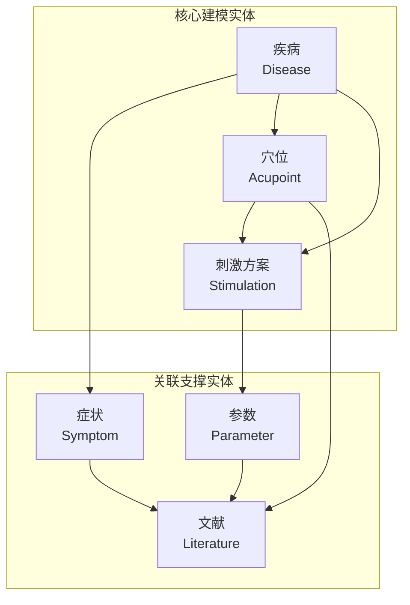
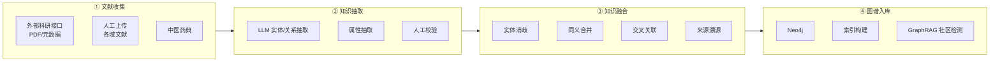
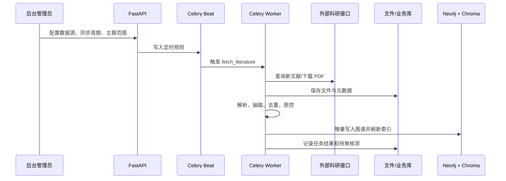
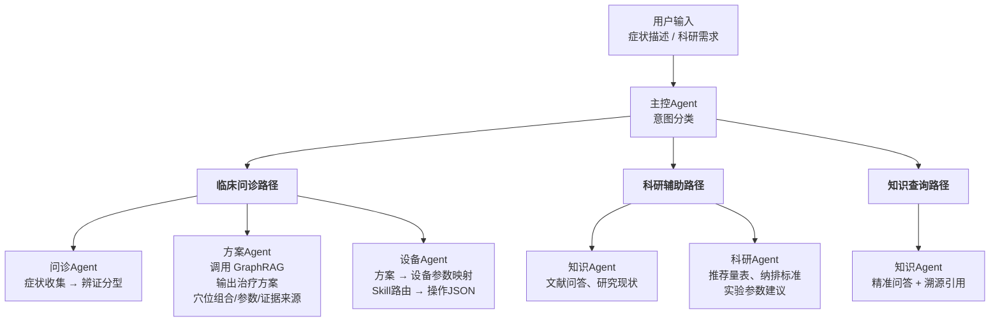

# 灵枢智衡 (LingShu Nexus) — 技术实施方案

> 基于 [需求与技术整理](./中医脑机接口项目-需求与技术整理.md) 和 [GraphRAG调研及框架设计](./GraphRAG与知识图谱技术调研及框架设计.md)
> 整理日期：2026-05-11 | 更新日期：2026-05-14

---

## 一、技术栈

| 层级 | 选型 | 说明 |
|------|------|------|
| 前端 | **Vue 3** + Vite + TypeScript | 团队熟悉，中文生态好 |
| 后端 | **Python FastAPI** | 异步高性能，AI 生态无缝对接 |
| 智能体框架 | **LangGraph** | 多 Agent 编排，状态图管理 |
| GraphRAG 引擎 | **LightRAG** (主) + **KAG** (逻辑推理补充) | 增量更新 + 可审计推理链 |
| 图数据库 | **Neo4j** | 生产级图存储，Cypher 查询，GDS 算法库 |
| 向量数据库 | **Chroma** | 轻量嵌入存储，LightRAG 内置支持 |
| 业务数据库 | **PostgreSQL** + SQLAlchemy + Alembic | 用户、权限、任务、文献元数据、Skill 版本、审核状态 |
| 任务队列 | **Celery** + Redis + Celery Beat | 外部接口拉取、PDF 解析、知识抽取、图谱入库、索引刷新 |
| 大模型 | **DeepSeek API** (主) / **GPT-4o** (备) | 中文抽取能力强，成本可控 |
| 文档解析 | **RAG-Anything** / **MinerU** | 多格式文献解析 |
| 包管理 | **Poetry** | Python 依赖管理 |
| 部署 | **Docker Compose** | 本地/服务器统一环境 |

---

## 二、系统架构

```mermaid
graph TB
    subgraph UI[<b>用户交互层 — Vue 3</b>]
        UI1[问诊页面<br/>症状输入 / 辨证展示]
        UI2[方案展示<br/>处方 / 参数 / 证据溯源]
        UI3[后台管理<br/>任务 / Skill / 数据源 / 审核]
        UI4[科研工作台<br/>文献管理 / 量表推荐]
    end

    subgraph API[<b>API 网关 — FastAPI</b>]
        Router[路由层]
        Router --> R1[/api/consultation]
        Router --> R2[/api/knowledge]
        Router --> R3[/api/device]
        Router --> R4[/api/research]
        Router --> R5[/api/admin]
        Router --> R6[/api/tasks]
        Router --> R7[/api/skills]
    end

    subgraph Agent[<b>智能体编排层 — LangGraph</b>]
        MainAgent[主控Agent<br/>意图识别 / 任务路由]
        MainAgent --> Sub1[问诊Agent<br/>症状→辨证分型]
        MainAgent --> Sub2[方案Agent<br/>GraphRAG检索→方案生成]
        MainAgent --> Sub3[科研Agent<br/>量表推荐 / 纳排标准]
        MainAgent --> Sub4[知识Agent<br/>文献问答 / 溯源]
        MainAgent --> Sub5[设备Agent<br/>设备控制 Skill / 操作JSON生成]
        MainAgent --> SkillLoader[Agent Skill Loader<br/>发现 / 注入 / 权限校验]
    end

    subgraph Jobs[<b>任务调度层 — Celery</b>]
        Beat[Celery Beat<br/>定时触发]
        Queue[Redis Queue<br/>任务队列]
        Worker[Celery Worker<br/>拉取 / 解析 / 抽取 / 入库]
    end

    subgraph GraphRAG[<b>GraphRAG 层</b>]
        LightRAG[LightRAG<br/>双层检索 / 增量更新]
        KAG[KAG<br/>逻辑推理 / 推理链追溯]
    end

    subgraph Data[<b>数据层</b>]
        Neo4j[(Neo4j<br/>知识图谱)]
        Chroma[(Chroma<br/>向量索引)]
        Postgres[(PostgreSQL<br/>业务数据)]
        Redis[(Redis<br/>队列 / 缓存)]
        FileStore[(文献文件存储<br/>PDF/文档)]
    end

    subgraph Skills[<b>Agent Skill 层</b>]
        SKILL[Skill Registry<br/>SKILL.md / 脚本 / 资源]
        SKILL --> SK1[文献抽取 Skill]
        SKILL --> SK2[图谱构建 Skill]
        SKILL --> SK3[科研方案 Skill]
        SKILL --> SK4[设备控制 Skill]
    end

    UI --> API
    API --> Agent
    API --> Jobs
    Agent --> GraphRAG
    Agent --> Skills
    Jobs --> GraphRAG
    GraphRAG --> Data
    Skills --> Data
    Jobs --> Data
```

### 六大子系统

| 子系统 | 职责 | 关键技术点 |
|--------|------|-----------|
| **问诊子系统** | 症状收集 → 辨证分型（八纲/脏腑/经络辨证） | LangGraph 状态图引导问诊流程 |
| **方案子系统** | 根据辨证结果 + 知识图谱检索 → 输出治疗处方 | LightRAG 检索 + KAG 推理 + 证据溯源 |
| **科研子系统** | 辅助实验设计，推荐量表/纳排标准/参数；接入外部科研接口拉取文献 | 知识图谱查询 + 模板填充 + 数据源适配 |
| **知识子系统** | 文献精准问答，可溯源引用 | LightRAG Local/Global Search |
| **Agent Skill 子系统** | 管理可被 agent 读取和执行的能力包 | `SKILL.md` 规范、版本管理、权限、试运行、审计 |
| **后台管理子系统** | 管理用户、数据源、定时任务、文献状态、图谱审核、系统监控 | RBAC + Celery 任务可视化 + 审核工作流 |

---

## 三、项目结构

```
lingshu-nexus/
├── backend/
│   ├── main.py                  # FastAPI 入口
│   ├── config.py                # 全局配置（API key, DB连接等）
│   ├── routers/                 # API 路由
│   │   ├── consultation.py      # /api/consultation
│   │   ├── knowledge.py         # /api/knowledge
│   │   ├── device.py            # /api/device
│   │   ├── research.py          # /api/research
│   │   ├── admin.py             # /api/admin
│   │   ├── tasks.py             # /api/tasks
│   │   └── skills.py            # /api/skills
│   ├── agents/                  # LangGraph Agent 定义
│   │   ├── main_agent.py        # 主控 Agent（意图路由）
│   │   ├── consultation_agent.py
│   │   ├── prescription_agent.py
│   │   ├── research_agent.py
│   │   ├── knowledge_agent.py
│   │   └── device_agent.py
│   ├── graph/                   # 知识图谱
│   │   ├── extraction/          # 实体/关系抽取
│   │   │   ├── prompt.py        # 抽取 Prompt 模板
│   │   │   └── extractor.py     # LLM 抽取器
│   │   ├── fusion/              # 知识融合（消歧/合并）
│   │   │   └── dedup.py
│   │   ├── storage/             # 图存储适配器
│   │   │   ├── neo4j.py         # Neo4j 读写
│   │   │   └── networkx.py      # NetworkX（小规模快速验证）
│   │   └── retrieval/           # 检索
│   │       ├── lightrag.py      # LightRAG 封装
│   │       └── kag.py           # KAG 逻辑推理封装
│   ├── skills/                  # Agent Skill 框架
│   │   ├── registry.py          # Skill 注册/发现/版本
│   │   ├── loader.py            # 读取 SKILL.md 并注入 Agent 上下文
│   │   ├── runner.py            # Skill 试运行/执行审计
│   │   └── validator.py         # 元数据、权限、输入输出校验
│   ├── scheduler/               # 定时任务与后台队列
│   │   ├── celery_app.py        # Celery 配置
│   │   ├── beat.py              # 定时任务注册
│   │   ├── tasks.py             # 拉取/解析/抽取/入库任务
│   │   └── retry.py             # 重试、补偿、死信处理
│   ├── integrations/            # 外部系统适配
│   │   ├── research_source.py   # 科研文献接口适配器
│   │   ├── device_gateway.py    # 设备网关适配
│   │   └── research_export.py   # 科研管理系统 2.0 回填
│   ├── admin/                   # 后台管理业务
│   │   ├── auth.py              # 登录、角色、权限
│   │   ├── audit.py             # 审计日志
│   │   └── review.py            # 文献/图谱审核流
│   ├── models/                  # Pydantic 数据模型
│   │   ├── schemas.py           # API 请求/响应 Schema
│   │   ├── knowledge.py         # 知识图谱实体/关系模型
│   │   ├── task.py              # 定时任务/执行记录模型
│   │   ├── skill.py             # Agent Skill 元数据模型
│   │   └── literature.py        # 文献元数据/解析状态模型
│   ├── services/                # 业务服务层
│   │   ├── consultation.py
│   │   ├── prescription.py
│   │   └── research.py
│   └── utils/                   # 工具函数
│       ├── llm.py               # LLM 调用封装
│       └── document.py          # 文档解析工具
├── frontend/
│   ├── src/
│   │   ├── views/               # 页面
│   │   │   ├── Consultation.vue # 问诊页
│   │   │   ├── Prescription.vue # 方案展示页
│   │   │   ├── Device.vue       # 设备管理页
│   │   │   ├── Research.vue     # 科研工作台
│   │   │   └── Admin.vue        # 后台管理入口
│   │   ├── admin/               # 后台管理模块
│   │   │   ├── DataSources.vue  # 文献数据源
│   │   │   ├── TaskBoard.vue    # 定时任务/执行记录
│   │   │   ├── SkillRegistry.vue# Agent Skill 管理
│   │   │   ├── LiteratureReview.vue
│   │   │   └── GraphReview.vue
│   │   ├── components/          # 通用组件
│   │   ├── api/                 # Axios API 调用封装
│   │   ├── router/              # Vue Router
│   │   └── stores/              # Pinia 状态管理
│   ├── vite.config.ts
│   └── package.json
├── data/                        # 文献原始数据
│   ├── literature/              # 按知识域分目录
│   │   ├── vns/
│   │   ├── ear_acupoint/
│   │   ├── teas/
│   │   └── acupuncture/
│   └── extracted/               # 抽取后的结构化数据
├── prompts/                     # Prompt 模板
│   ├── extraction_zh.yaml       # 中文实体关系抽取
│   └── consultation.yaml        # 问诊流程 Prompt
├── skills/                      # Agent Skill 定义目录
│   ├── literature-extraction/
│   │   ├── SKILL.md
│   │   ├── scripts/
│   │   └── references/
│   ├── graph-construction/
│   │   └── SKILL.md
│   ├── research-design/
│   │   └── SKILL.md
│   └── device-control/
│       ├── SKILL.md
│       └── device_schemas/
├── docker-compose.yml           # Neo4j + Chroma + App
├── Dockerfile
├── pyproject.toml
└── README.md
```

---

## 四、核心模块设计

### 4.1 知识图谱 Schema



| 关系 | 头实体 | 尾实体 | 示例 |
|------|--------|--------|------|
| `TREATS` | 穴位组合/刺激方案 | 疾病 | "足三里+内关" TREATS "失眠" |
| `HAS_SYMPTOM` | 疾病 | 症状 | "抑郁症" HAS_SYMPTOM "入睡困难" |
| `MENTIONED_IN` | 任意实体 | 文献 | 所有实体指向来源文献 |
| `HAS_PARAMETER` | 刺激方案 | 参数 | "迷走刺激方案A" HAS_PARAMETER "频率20Hz" |
| `RELATED_TO` | 耳穴 | 传统穴位 | "耳神门" RELATED_TO "神门穴" |
| `CONTRAINDICATED_FOR` | 方案 | 禁忌症 | "电针方案B" CONTRAINDICATED_FOR "妊娠" |

**Literature 属性**：title, authors (list), year (int), journal, evidence_level (enum: RCT/系统综述/病例报告/专家意见), sample_size, doi, abstract, full_text_ref

### 4.2 知识图谱构建流程



**抽取策略**：
- 使用 DeepSeek API 批量抽取，Prompt 模板中定义实体类型、关系类型、属性
- 小模型（7B/14B）不用于抽取——经验表明质量很差
- 人工校验节点：标注证据等级、修正中医专业术语
- 知识融合：向量相似度粗筛 → LLM 精判是否为同义实体

### 4.3 科研数据源与定时任务

科研板块不是只做一次性上传，而是要接入外部接口，周期性获取 PDF、文献元数据或其他材料，再进入图谱构建流水线。



**数据源配置模型**：

| 字段 | 说明 |
|------|------|
| `id` | 数据源 ID |
| `name` | 数据源名称，例如“针灸科研接口” |
| `base_url` | 外部接口地址 |
| `auth_type` | `none` / `api_key` / `bearer` / `basic` |
| `query_params` | 默认主题、疾病、干预方式、起止时间等 |
| `schedule` | Cron/interval 规则 |
| `dedup_keys` | DOI、PMID、标题哈希、文件哈希 |
| `enabled` | 是否启用 |

**任务状态机**：

```
PENDING → FETCHING → DOWNLOADED → PARSING → EXTRACTING → REVIEWING → INDEXING → COMPLETED
                         │             │             │             │
                         └─────────────┴─────────────┴─────────────┘
                                      FAILED / RETRYING
```

**任务类型**：
- `fetch_literature`：调用外部接口，下载 PDF 或读取元数据
- `parse_document`：调用 MinerU/RAG-Anything，将 PDF 转为结构化文本与图表信息
- `extract_knowledge`：调用文献抽取 Skill，抽取 PICO、穴位、刺激参数、疗效指标、证据等级
- `merge_entities`：实体消歧、同义合并、冲突标记
- `write_graph`：写入 Neo4j，更新实体、关系、属性和来源边
- `refresh_index`：刷新 LightRAG/Chroma 索引
- `notify_review`：生成待专家审核清单

### 4.4 智能体协作流程



**主控Agent 意图识别规则**：

| 用户输入特征 | 路由路径 | 示例 |
|-------------|---------|------|
| 症状描述、体征信息 | 临床问诊路径 | "失眠、心悸两周" |
| 实验设计、纳排标准、量表 | 科研辅助路径 | "设计一个耳穴治疗失眠的RCT" |
| 文献内容、知识问答 | 知识查询路径 | "耳神门穴的刺激参数有哪些" |

### 4.5 Agent Skill 机制

本项目采用 Agent Skill 作为可复用能力包。Skill 的核心不是“设备配置”，而是让 agent 在特定任务中读取一份可执行说明，并按其中的流程、约束、脚本和资源完成工作。

推荐目录结构：

```
skills/literature-extraction/
├── SKILL.md              # 必需：触发条件、步骤、输入输出、安全约束
├── scripts/              # 可选：解析、校验、转换脚本
├── references/           # 可选：术语表、抽取 Schema、示例
└── templates/            # 可选：Prompt、报告模板、JSON 模板
```

`SKILL.md` 示例：

```markdown
---
name: literature-extraction
description: 从针灸、耳穴、TEAS、迷走刺激相关 PDF 中抽取结构化证据，用于知识图谱构建。
version: 0.1.0
owner: zhangjie
allowed_tools:
  - document_parser
  - llm_extractor
  - schema_validator
---

# Literature Extraction Skill

## When to use
当任务涉及从文献 PDF、摘要或全文中抽取 PICO、穴位、刺激参数、疗效指标、样本量、证据等级时使用。

## Steps
1. 读取文献元数据和全文解析结果。
2. 按 references/extraction_schema.json 抽取实体、关系和属性。
3. 对 DOI、PMID、穴位名、疾病名、量表名做标准化。
4. 输出 JSON，不直接写入生产图谱；需要进入审核或入库任务。

## Output
返回符合 extraction_schema.json 的 JSON，并附上原文证据片段位置。
```

**Skill 生命周期**：

```
上传/创建 → 元数据校验 → 安全检查 → 管理员审核 → 启用 → Agent 按需加载 → 执行记录 → 版本回滚
```

**Skill 注册字段**：

| 字段 | 说明 |
|------|------|
| `name` | Skill 唯一名称 |
| `description` | 触发条件摘要，用于 agent 判断是否加载 |
| `version` | 语义化版本 |
| `owner` | 维护人 |
| `status` | `draft` / `reviewing` / `active` / `disabled` / `archived` |
| `allowed_tools` | 允许调用的工具或内部服务 |
| `entry_file` | 默认 `SKILL.md` |
| `checksum` | 内容哈希，用于审计与回滚 |

**Agent 加载策略**：
- 主控 Agent 先基于用户意图和任务上下文检索 Skill Registry
- 只加载与当前任务最相关的少量 `SKILL.md`，避免上下文污染
- 对涉及设备控制、图谱写入、批量任务执行的 Skill 做权限校验
- Skill 可以引用脚本和模板，但脚本执行必须经过白名单和参数校验
- 所有 Skill 执行都写入审计日志，记录输入摘要、版本、输出、耗时、错误和调用人

### 4.6 设备控制 Skill

设备控制是 Agent Skill 的一种具体类型。每种设备保留结构化 schema，供设备控制 Skill 将治疗方案映射为可执行 JSON：

```yaml
# skills/ultimate_box.yaml
id: ultimate_box_v1
name: 终极盒刺激器
version: 1.0
protocol: http
endpoint: http://device-ip:8080/command
auth:
  type: api_key
  header: X-Device-Key
schema:
  commands:
    stimulate:
      description: 发起电刺激
      parameters:
        channel:
          type: int
          description: 通道编号 (1-4)
          range: [1, 4]
        frequency_hz:
          type: float
          description: 刺激频率
          range: [1, 100]
        intensity_ma:
          type: float
          description: 电流强度 (mA)
          range: [0.1, 10.0]
        duration_s:
          type: int
          description: 刺激时长 (秒)
          range: [1, 3600]
        waveform:
          type: enum
          values: [sine, square, pulse]
    stop:
      description: 停止刺激
      parameters: {}
```

**设备Agent 工作流程**：

```
设备请求 (含 device_id + 操作意图)
       │
       ▼
Skill Registry ──→ 根据 device_id 路由到对应设备控制 Skill
       │
       ▼
读取设备 Schema ──→ 校验参数 → 生成符合协议的 JSON
       │
       ▼
返回 JSON 给设备 ──→ 设备解析执行 → 回传结果
       │
       ▼
记录执行日志 + 可选回写知识图谱（刺激效果反馈）
```

---

## 五、API 设计概要

### 5.1 问诊接口

```
POST /api/consultation/start
  启动问诊会话，返回会话 ID 和第一个问题

POST /api/consultation/{session_id}/respond
  提交回答，Agent 决定追问或完成辨证

GET  /api/consultation/{session_id}/result
  获取辨证结果 + 推荐方案
```

### 5.2 方案接口

```
GET  /api/prescription/{session_id}
  基于辨证结果的治疗方案（穴位/参数/证据）

POST /api/prescription/generate
  直接根据症状描述生成方案（不走完整问诊流程）

GET  /api/prescription/{id}/evidence
  方案的证据溯源链（文献 + 证据等级）
```

### 5.3 知识接口

```
POST /api/knowledge/search
  GraphRAG 问答（支持 local / global / drift 模式）

GET  /api/knowledge/entity/{id}
  查询特定实体（穴位/疾病/方案）的关联图谱

POST /api/knowledge/import
  文献批量导入 + 触发抽取

POST /api/knowledge/review/{item_id}/approve
  审核通过待入库实体/关系

POST /api/knowledge/review/{item_id}/reject
  驳回或标记需人工修正
```

### 5.4 设备接口

```
GET    /api/device/devices
  列出已注册设备

POST   /api/device/devices
  注册设备连接信息与设备 schema

POST   /api/device/{skill_id}/command
  设备端调用：由设备控制 Skill 生成操作 JSON

POST   /api/device/{skill_id}/callback
  设备端回调：上报执行结果
```

### 5.5 科研接口

```
POST /api/research/scale-recommend
  推荐评估量表

POST /api/research/criteria
  推荐纳入/排除标准

POST /api/research/parameter
  推荐刺激参数

GET  /api/research/export/{project_id}
  导出方案到科研管理系统（预留接口，返回 JSON）
```

### 5.6 科研数据源接口

```
GET  /api/research/sources
  查看外部科研数据源列表

POST /api/research/sources
  新增数据源：接口地址、认证方式、默认查询参数、同步周期

PUT  /api/research/sources/{source_id}
  修改数据源配置

POST /api/research/sources/{source_id}/sync
  立即触发一次同步任务

GET  /api/research/literature
  查询已入库文献、解析状态、抽取状态、审核状态
```

### 5.7 定时任务接口

```
GET  /api/tasks
  查询任务列表，支持按类型、状态、数据源、时间筛选

POST /api/tasks
  创建一次性任务或定时任务

POST /api/tasks/{task_id}/run
  立即执行

POST /api/tasks/{task_id}/pause
  暂停任务

POST /api/tasks/{task_id}/resume
  恢复任务

POST /api/tasks/{task_id}/retry
  重试失败任务

GET  /api/tasks/{task_id}/logs
  查看执行日志、错误堆栈、输入输出摘要
```

### 5.8 Agent Skill 接口

```
GET  /api/skills
  列出 Agent Skill 及版本

POST /api/skills
  上传或创建 Skill 目录，核心为 SKILL.md

GET  /api/skills/{skill_id}
  查看 Skill 元数据、内容摘要、版本历史

POST /api/skills/{skill_id}/validate
  校验 SKILL.md 元数据、脚本引用、输入输出 schema

POST /api/skills/{skill_id}/test-run
  使用样例输入试运行，返回执行日志和输出

POST /api/skills/{skill_id}/approve
  审核通过并启用

POST /api/skills/{skill_id}/rollback
  回滚到指定版本
```

### 5.9 后台管理接口

```
POST /api/admin/auth/login
  后台登录

GET  /api/admin/users
  用户与角色管理

GET  /api/admin/audit-logs
  查看登录、Skill 执行、图谱写入、任务操作审计日志

GET  /api/admin/metrics
  系统运行指标：任务成功率、模型调用量、Token 成本、队列积压、数据库状态
```

---

## 六、前端页面设计

| 页面 | 路由 | 核心功能 |
|------|------|---------|
| **问诊页面** | `/consultation` | 症状输入 → 逐轮问诊对话 → 辨证结果展示 |
| **方案页面** | `/prescription/:id` | 穴位组合卡片 / 参数配置 / 证据来源列表 |
| **设备管理** | `/device` | 设备注册 / 设备 schema / 已注册设备列表 / 执行日志 |
| **科研工作台** | `/research` | 研究方向输入 → 量表/纳排/参数推荐展示 |
| **知识检索** | `/knowledge` | GraphRAG 问答输入框 / 知识图谱可视化 / 溯源引用 |
| **后台管理** | `/admin` | 数据源 / 定时任务 / 文献状态 / 图谱审核 / Agent Skill / 系统监控 |

后台管理页面优先级：

| 优先级 | 页面 | 最小可用能力 |
|--------|------|-------------|
| P0 | 任务管理 | 查看、立即执行、暂停、恢复、重试、日志 |
| P0 | 数据源管理 | 配置外部接口、认证、同步周期、查询参数 |
| P0 | 文献入库状态 | 文件下载、解析、抽取、审核、入库状态 |
| P1 | Agent Skill 管理 | 上传、校验、启停、试运行、版本回滚 |
| P1 | 图谱审核 | 实体合并、关系确认、冲突处理 |
| P2 | 用户权限 | RBAC、审计日志、操作追踪 |
| P2 | 系统监控 | 队列、Token、失败率、数据库健康度 |

---

## 七、开发环境

### docker-compose.yml 核心服务

| 服务 | 端口 | 用途 |
|------|------|------|
| `neo4j` | 7474 (HTTP), 7687 (Bolt) | 图数据库 |
| `chroma` | 8001 | 向量存储 |
| `postgres` | 5432 | 业务数据库 |
| `redis` | 6379 | Celery 队列与缓存 |
| `backend` | 8000 | FastAPI 服务 |
| `worker` | — | Celery Worker，执行文献拉取/解析/抽取/入库 |
| `beat` | — | Celery Beat，触发定时任务 |
| `frontend` | 5173 | Vue 3 开发服务器 |

### 启动命令

```bash
# 基础设施
docker compose up -d neo4j chroma postgres redis

# 后端
cd backend && poetry run uvicorn main:app --reload

# 后台任务
cd backend && poetry run celery -A scheduler.celery_app worker -l info
cd backend && poetry run celery -A scheduler.celery_app beat -l info

# 前端
cd frontend && npm run dev
```

---

## 八、关键技术决策记录

| 决策点 | 选择 | 理由 |
|--------|------|------|
| GraphRAG 主引擎 | LightRAG | 增量更新、Token 成本极低（仅 GraphRAG 的 0.02%）、集成 RAG-Anything |
| 逻辑推理补充 | KAG | 可审计推理链，医疗场景合规需求 |
| 图数据库 | Neo4j | GDS 算法库、Cypher 生态、可视化工具成熟 |
| 主 LLM | DeepSeek API | 中文能力强、成本可控、≥70B 规模保证抽取质量 |
| 前端 | Vue 3 | 团队熟悉、中文文档完善、Vite 构建快 |
| 智能体框架 | LangGraph | StateGraph 天然适合多 Agent 协作，支持人机交互节点 |
| 知识抽取模型 | DeepSeek/GPT-4o | 7B/14B 小模型抽取质量差，必须用大模型或商业 API |
| Agent Skill | `SKILL.md` 能力包 | Skill 是给 agent 读取和执行的流程规范，可沉淀文献抽取、图谱构建、设备控制、科研方案等能力 |
| 设备接入 | 设备控制 Skill + 设备 schema | 设备热插拔、新增设备不改 Agent 代码 |
| 任务调度 | Celery + Redis + Celery Beat | 支持外部科研接口定时同步、失败重试、长任务异步化 |
| 业务数据 | PostgreSQL | 管理用户、任务、文献、Skill 版本、审核状态，比放在 Neo4j 更适合事务型数据 |
| 科研系统集成 | 先接入文献数据源 API，方案回填保留 API 契约 | Phase 1 优先保证“外部接口 → 文献 → 图谱”的自动化链路 |
| 部署方式 | Docker Compose | 统一开发/演示环境，后续可平滑过渡到 K8s |

---

## 九、关键风险

| 风险 | 影响 | 缓解措施 |
|------|------|---------|
| 小模型知识抽取质量差 | 图谱不可用 | 使用 DeepSeek/GPT-4o 商业 API（≥70B） |
| LightRAG 中文 Prompt 效果差 | 问答不准 | 参考 OpenTCM 中文模板，自行改写优化 |
| 各知识域文献质量参差不齐 | 知识可信度低 | 仅纳入 SCI/核心期刊，标注证据等级 |
| 中医领域需要专家校验 | 知识错误 | 与陆教授团队合作，建立人工校验流程 |
| Token 成本过高 | 预算超支 | LightRAG 成本极低，可控制 |
| 多学生并行提交数据 | 知识冲突 | 知识融合模块 + 人工审核节点 |
| 外部科研接口不稳定 | 定时同步失败、文献缺失 | 任务重试、断点续传、失败告警、手动补跑 |
| Agent Skill 内容不规范 | Agent 执行跑偏或输出不可控 | SKILL.md 模板、元数据校验、管理员审核、试运行后启用 |
| 定时任务重复入库 | 图谱出现重复实体/关系 | DOI/PMID/文件哈希去重，入库前实体融合 |
| 后台权限过宽 | 误删任务、误启用不成熟 Skill | RBAC、危险操作二次确认、审计日志、版本回滚 |

---

## 十、参考资料

- OpenAI Skills 仓库：Agent Skill 是包含说明、脚本和资源的文件夹，用于让 AI agent 发现并完成特定任务。参考：[openai/skills](https://github.com/openai/skills)
- GitHub Copilot Agent Skill 文档：每个 skill 是一个目录，包含 `SKILL.md`，也可包含脚本和补充资料；相关 skill 的 `SKILL.md` 会被注入 agent 上下文。参考：[Adding agent skills for GitHub Copilot](https://docs.github.com/en/copilot/how-tos/copilot-on-github/customize-copilot/customize-cloud-agent/add-skills)
