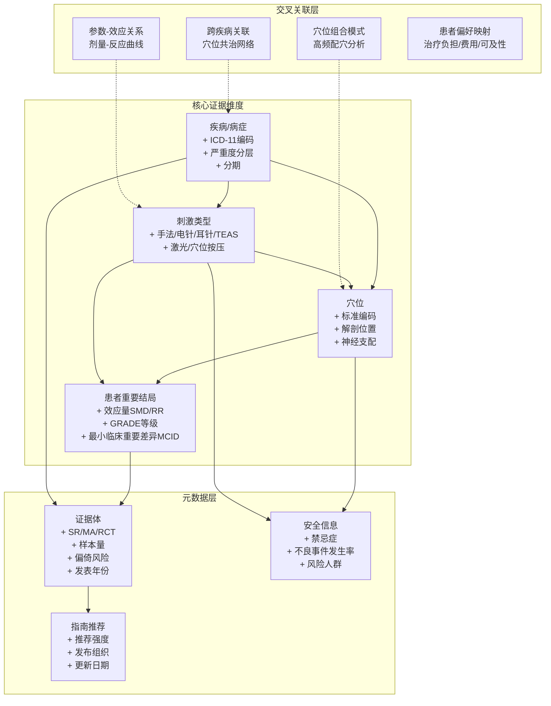

# 针灸临床指南与证据图谱的智能化优化方案

> 基于两篇 BMJ 论文的核心发现 + 2025-2026 年最新 GraphRAG/知识图谱/LLM 技术进展
> 服务于"灵枢智衡 (LingShu Nexus)"中医脑机接口项目

---

## 一、两篇论文的核心问题诊断

### 论文一：BMJ 2022 — Increasing the usefulness of acupuncture guideline recommendations

**作者**：Yu-Qing Zhang, Liming Lu, Nenggui Xu, Gordon Guyatt, et al.

**核心发现**：

| 问题维度 | 具体表现 | 数据 |
|----------|----------|------|
| 患者特征缺失 | 指南推荐未明确适用人群 | <4% 报告病情严重度，<30% 报告疾病分期 |
| 干预描述不足 | 未说明针灸类型、穴位选择 | 仅 40% 指定针灸类型，仅 5% 指定穴位范围 |
| 对照不明确 | 推荐意见缺乏参照系 | 大量指南未明确比较对象 |
| 结局报告不完整 | 未考虑全部患者重要结局 | 近半数综合医学指南未报告评估的结局 |
| 患者价值观缺位 | 未考虑患者偏好 | <20% 指南明确考虑了患者价值观与偏好 |
| 证据利用不足 | 已证明有效的针灸未被纳入 | 15 种疾病/病症有中-大效应量但指南未推荐 |

**论文提出的改进方向**：
1. 常规医学学会与针灸专业学会联合制定指南
2. 以患者为中心的指南和推荐意见
3. 明确描述干预、对照和适用人群
4. 使用整体证据体（entire body of evidence）
5. 明确考虑患者价值观与偏好

### 论文二：BMJ Open 2022 — Evidence on acupuncture therapies is underused in clinical practice and health policy

**作者**：Liming Lu, Yuqing Zhang, Nenggui Xu, Gordon Guyatt, et al.（同一课题组）

**核心发现**：
- 覆盖 12 个治疗领域、77 种疾病/病症、120 篇系统综述、1402 项 RCT、138,995 名参与者
- 构建了 77 个证据矩阵并数字化到 Epistemonikos 平台
- **99.2% 的系统综述质量被评为"低"或"极低"**
- **80.8% 未使用 GRADE 证据分级**

**针灸利用不足但证据较强的领域**（高/中确定性 + 中/大效应）：

| 效应量 | 确定性 | 疾病/病症 |
|--------|--------|----------|
| 大效应 | 中确定性 | 卒中后失语、肌筋膜疼痛、产后 24h 泌乳 |
| 中效应 | 高确定性 | 颈痛、肩痛 |
| 中效应 | 中确定性 | 血管性痴呆、纤维肌痛、非特异性下腰痛、过敏性鼻炎 |

**针灸有前景但需进一步研究的领域**（低/极低确定性 + 大效应）：
消化性溃疡、尿路感染、戒烟、腕管综合征、更年期综合征、阿片类药物使用障碍、儿童自闭症等 30+ 种病症。

---

## 二、论文设计的四大核心局限（用 2026 年视角审视）

### 局限 1：证据图谱是"静态快照"，非"活系统"

论文构建的证据矩阵基于 2015-2020 年数据，截止 2022 年发表时已有 2 年滞后。新 RCT 发表后需人工重新提取、评估、汇总。这在 2026 年的技术条件下已可完全自动化。

### 局限 2：证据导航依赖人工检索，缺乏智能问答接口

虽然数字化到了 Epistemonikos 平台，但用户（临床医生、指南制定者、政策制定者）仍需主动浏览、筛选、理解复杂的证据矩阵，缺乏"自然语言提问 → 精准证据应答"的能力。

### 局限 3：证据综合到指南推荐的转化链路缺失

论文识别了"有效但未被充分利用"的领域，但没有提供将这些证据自动转化为可操作指南推荐的技术路径。GRADE 评估仍完全依赖人工。

### 局限 4：缺少患者个体化匹配层

证据图谱提供的是群体层面的效应量，但临床决策需要将群体证据匹配到个体患者（特定的年龄、病情严重度、合并症、偏好）——论文没有提供这一层的技术方案。

---

## 三、2025-2026 年可用的最新技术武器库

### 3.1 核心框架层

| 技术 | 版本/时间 | 核心能力 | 与本方案的契合点 |
|------|----------|----------|-----------------|
| **LightRAG** | 2024-2025 (29k+ stars) | 双层检索（低层精确匹配 + 高层语义匹配）、增量更新、Token 成本仅 GraphRAG 的 0.02% | 证据图谱的持续增量更新，新文献即插即用 |
| **KAG** (OpenSPG) | 2025 WWW (8k+ stars) | 逻辑形式引导的混合推理、知识-文本互索引、可审计推理链 | 证据等级判定、GRADE 自动评估、推荐意见的逻辑一致性校验 |
| **KAG-Thinker** | 2025.06 | 多轮交互式深度推理、广度分解 + 深度求解、知识边界判定 | 复杂临床问题的多步推理 |
| **Microsoft GraphRAG** | 2024-2025 (31k+ stars) | Leiden 社区检测、全局/局部/漂移检索 | 跨疾病领域的证据社区发现（如"耳穴"相关证据的聚类） |
| **LangGraph** | 2025 | 多 Agent 状态图编排、人机交互节点 | 多 Agent 临床决策流程编排 |

### 3.2 医学专用方案

| 技术 | 核心创新 | 与本方案的关联 |
|------|----------|---------------|
| **MedGraphRAG** (ACL 2025) | 三重图构建 + U-Retrieval（自顶向下精确检索 + 自底向上响应优化） | 证据检索的精度优化范式 |
| **MediGRAF** (2026.03) | Neo4j Text2Cypher + 向量嵌入混合管线，100% 召回率，零安全违规 | 混合检索架构直接复用 |
| **MIRAGE** (AAAI 2026) | 查询分解 → 并行图推理链 → 交叉验证 → 矛盾消解 | 复杂临床问题的多路径推理验证 |
| **CuraView** (2026.05) | GraphRAG + 四级证据分级 + 闭环幻觉检测 | 安全关键场景的证据验证 |
| **CORE-Acu** (2025) | 针灸 CDS 专用：结构化思维链 + KG 安全校验 + 符号否决机制，0/1000 安全违规 | **直接针对针灸场景的安全框架** |
| **RSA-KG** (2025.10) | LightRAG + DeepSeek-R1，多模型共识实体抽取，准确率 86.5% | 中医领域知识抽取的工程参考 |

### 3.3 针灸专用知识图谱

| 资源 | 规模 | 可复用性 |
|------|------|----------|
| **AcuKG** (2025.03, JAMIA) | 1,839 实体、11,527 关系，映射到 SNOMED CT / UBERON / MeSH | **直接可接入**，Harvard/Yale/Mayo 合作产出，开源 |
| **OpenTCM** (2025, BIGCOM25 最佳论文) | 48,000+ 实体、152,000+ 关系，68 本中医妇科典籍 | 中医知识图谱构建流水线可直接复用 |
| **CORE-Acu** (2025) | 针灸安全知识图谱 + 符号否决规则库 | 安全校验层直接集成 |

---

## 四、优化后的技术架构设计

### 4.1 系统全景架构（三层闭环）

```
┌─────────────────────────────────────────────────────────────────┐
│                    用户交互层 (Multi-Modal)                       │
│  ┌──────────┐  ┌──────────┐  ┌──────────┐  ┌──────────────┐   │
│  │ 临床医生  │  │ 指南制定者│  │ 患者/公众 │  │ 政策制定者    │   │
│  │ NL问诊+CDS│  │ 指南生成  │  │ 治疗查询  │  │ 证据概览      │   │
│  └─────┬─────┘  └─────┬─────┘  └─────┬─────┘  └──────┬───────┘   │
│        └───────────────┴──────────────┴───────────────┘          │
│                                │                                  │
├────────────────────────────────┼──────────────────────────────────┤
│                    智能体编排层 (LangGraph)                        │
│  ┌─────────────────────────────────────────────────────────┐    │
│  │                   主控 Agent (Router)                     │    │
│  │         意图识别 → 任务分解 → 子Agent调度 → 结果汇总      │    │
│  └───┬──────────┬──────────┬──────────┬──────────┬─────────┘    │
│      │          │          │          │          │               │
│  ┌───▼───┐ ┌───▼───┐ ┌───▼───┐ ┌───▼───┐ ┌───▼──────┐        │
│  │证据   │ │指南   │ │患者   │ │安全   │ │知识      │        │
│  │检索   │ │生成   │ │匹配   │ │校验   │ │更新      │        │
│  │Agent  │ │Agent  │ │Agent  │ │Agent  │ │Agent     │        │
│  └───┬───┘ └───┬───┘ └───┬───┘ └───┬───┘ └───┬──────┘        │
│      └─────────┴─────────┴─────────┴─────────┘                │
│                          │                                       │
├──────────────────────────┼───────────────────────────────────────┤
│              混合检索推理层 (Hybrid GraphRAG)                     │
│  ┌───────────────────────┴──────────────────────────────┐       │
│  │  ┌──────────┐  ┌──────────┐  ┌──────────────────┐   │       │
│  │  │ LightRAG │  │   KAG    │  │ MIRAGE 并行推理  │   │       │
│  │  │ 双层检索  │  │ 逻辑推理  │  │ 多路径交叉验证   │   │       │
│  │  │ 增量更新  │  │ 推理链溯源│  │ 矛盾消解        │   │       │
│  │  └────┬─────┘  └────┬─────┘  └───────┬──────────┘   │       │
│  │       └──────────────┴───────────────┘               │       │
│  │                       │                               │       │
│  │  ┌────────────────────▼──────────────────────────┐   │       │
│  │  │         HybridRAG 统一检索总线                  │   │       │
│  │  │  Text2Cypher(结构化) + 向量(语义) + 图遍历(关联) │   │       │
│  │  └────────────────────┬──────────────────────────┘   │       │
│  └───────────────────────┼──────────────────────────────┘       │
│                          │                                       │
├──────────────────────────┼───────────────────────────────────────┤
│                   知识图谱数据层 (Neo4j)                           │
│  ┌───────────────────────┴──────────────────────────────┐       │
│  │   ┌─────────┐   ┌──────────┐   ┌────────────────┐   │       │
│  │   │ 静态图谱  │   │ 动态图谱  │   │ 融合层          │   │       │
│  │   │ AcuKG   │   │ 实时RCT  │   │ 实体消歧/对齐   │   │       │
│  │   │ OpenTCM │   │ 新SR/MA  │   │ 证据等级标注    │   │       │
│  │   │ 中医药典  │   │ 新指南   │   │ 跨域关联        │   │       │
│  │   └─────────┘   └──────────┘   └────────────────┘   │       │
│  └───────────────────────┬──────────────────────────────┘       │
│                          │                                       │
├──────────────────────────┼───────────────────────────────────────┤
│                   数据摄入层 (Automated Pipeline)                  │
│  ┌───────────────────────┴──────────────────────────────┐       │
│  │  PubMed/CNKI/Epistemonikos 持续监控                   │       │
│  │  → LLM PICO自动抽取 → GRADE自动评估                    │       │
│  │  → 实体/关系/属性提取 → 知识融合 → 图谱写入            │       │
│  └──────────────────────────────────────────────────────┘       │
└─────────────────────────────────────────────────────────────────┘
```

### 4.2 核心创新点：将论文的静态设计变为"活系统"

#### 创新 1：从"静态证据图谱"到"活证据图谱" (Living Evidence Map)

**论文现状**：手动检索 2015-2020 年 SR，人工提取效应量，一次性构建证据矩阵。

**优化方案**：

```
PubMed/CNKI/Epistemonikos/Cochrane 持续监听
        │
        ▼
┌─────────────────────────────────────┐
│  ① 新文献自动发现与去重              │
│  - RSS/API 监听新增 RCT/SR/MA       │
│  - 与已收录文献指纹去重              │
└──────────────┬──────────────────────┘
               ▼
┌─────────────────────────────────────┐
│  ② LLM 驱动 PICO 自动抽取           │
│  - Population: 人群/疾病/分期/严重度 │
│  - Intervention: 针灸类型/穴位/参数  │
│  - Comparison: 对照类型              │
│  - Outcome: 患者重要结局 + 效应量    │
│  - 使用 DeepSeek/GPT-4o ≥70B 模型   │
└──────────────┬──────────────────────┘
               ▼
┌─────────────────────────────────────┐
│  ③ 自动 GRADE 证据等级评估           │
│  - 偏倚风险 / 不一致性 / 间接性      │
│  - 不精确性 / 发表偏倚               │
│  - LLM + 规则引擎混合判定            │
│  - 人工校验节点（高影响决策）        │
└──────────────┬──────────────────────┘
               ▼
┌─────────────────────────────────────┐
│  ④ 知识图谱增量更新                  │
│  - 新实体/关系/属性写入 Neo4j        │
│  - LightRAG 增量索引（无需全量重建） │
│  - 证据矩阵自动刷新                  │
│  - 冲突检测：新证据 vs 旧证据        │
└──────────────┬──────────────────────┘
               ▼
┌─────────────────────────────────────┐
│  ⑤ 主动预警与推送                    │
│  - 新证据显著改变效应量 → 通知       │
│  - 某领域证据等级升级 → 指南更新提示 │
│  - 新 RCT 填补证据空白 → 研究优先级调整│
└─────────────────────────────────────┘
```

**对比论文的改进**：

| 维度 | 论文方案 (2022) | 优化方案 (2026) |
|------|----------------|----------------|
| 更新方式 | 一次性手动检索 | 持续自动监听 + 增量更新 |
| 覆盖时效 | 静态快照 (2015-2020) | 近实时 (新文献发表即摄入) |
| PICO 提取 | 人工阅读提取 | LLM 自动结构化抽取 |
| GRADE 评估 | 人工逐一评估 | LLM + 规则引擎半自动 |
| 证据导航 | Epistemonikos 浏览 | 自然语言问答 + 可视化探索 |
| 更新触发 | 人工决定 | 新证据自动触发 + 显著性检测 |

#### 创新 2：从"被动指南文档"到"主动临床决策支持" (Active CDS)

**论文现状**：识别了指南推荐的缺陷（缺乏患者细节、干预描述、对照说明、价值观考虑），但只提出了原则性建议。

**优化方案 — 基于 Multi-Agent 的指南生成与 CDS 流水线**：

```
临床医生输入患者信息
        │
        ▼
┌─────────────────────────────────────────────┐
│  患者匹配 Agent                              │
│  - 从非结构化描述中提取结构化患者画像         │
│  - 病情严重度 / 疾病分期 / 合并症 / 年龄      │
│  - 患者偏好（愿意接受针刺 vs 偏好经皮电刺激） │
│  - 治疗史（既往是否接受过针灸）              │
└──────────────┬──────────────────────────────┘
               ▼
┌─────────────────────────────────────────────┐
│  证据检索 Agent (LightRAG + KAG)             │
│  - Local Search: 精准匹配该疾病+该患者画像   │
│  - Global Search: 该领域整体证据概览          │
│  - Drift Search: 相邻疾病/穴位的可能适用证据  │
│  - 检索结果带证据等级 + 效应量 + 来源文献     │
└──────────────┬──────────────────────────────┘
               ▼
┌─────────────────────────────────────────────┐
│  指南生成 Agent                              │
│  - 基于证据生成结构化推荐意见                │
│  - 自动填充论文指出的缺失要素：              │
│    ✓ 适用人群（严重度/分期明确）             │
│    ✓ 针灸类型（手法/电针/耳针/TEAS）         │
│    ✓ 穴位选择（主穴+配穴，带证据支撑）       │
│    ✓ 治疗参数（频率/时长/疗程）              │
│    ✓ 对照说明（vs 假针刺/vs 常规治疗/vs 无干预）│
│    ✓ 患者重要结局（获益/风险/负担）          │
│    ✓ 患者价值观考量                          │
│  - 输出 GRADE 分级 + 推荐强度                │
└──────────────┬──────────────────────────────┘
               ▼
┌─────────────────────────────────────────────┐
│  安全校验 Agent (CORE-Acu 模式)              │
│  - KG 安全约束检查（禁忌症/穴位禁忌组合）    │
│  - 符号否决机制：触发硬约束 → 直接驳回       │
│  - 证据-推荐一致性校验                       │
│  - 输出安全评分 + 风险提示                   │
└──────────────┬──────────────────────────────┘
               ▼
┌─────────────────────────────────────────────┐
│  方案输出                                    │
│  ┌───────────────────────────────────────┐  │
│  │ 推荐方案卡片                          │  │
│  │ ├ 针灸类型: 电针 (中等确定性证据)     │  │
│  │ ├ 主穴: 足三里 (ST36) + 内关 (PC6)    │  │
│  │ ├ 配穴: 太冲 (LR3) [随证加减]         │  │
│  │ ├ 参数: 疏密波, 2/100Hz, 30min/次     │  │
│  │ ├ 疗程: 每周3次 × 4周                │  │
│  │ ├ 证据等级: GRADE 中 (⭐⭐⭐)         │  │
│  │ ├ 效应量: SMD -0.65 [95%CI -0.82~-0.48]│  │
│  │ ├ 来源: [3篇SR, 12项RCT] 可展开     │  │
│  │ ├ 安全: ✅ 无禁忌冲突               │  │
│  │ └ 备选方案: [手法针灸] [经皮电刺激]  │  │
│  └───────────────────────────────────────┘  │
└─────────────────────────────────────────────┘
```

#### 创新 3：从"单一证据维度"到"多维度交叉证据网络"

**论文现状**：证据矩阵以"疾病-结局"为组织维度，但针灸的特殊性在于——同一穴位可治疗多种疾病（如足三里既治胃肠病又治失眠），同一疾病有多种针灸变体（手法/电针/耳针/穴位按压），不同针灸类型的作用机制和证据强度可能不同。

**优化方案 — 多维交叉知识图谱 Schema**：



**关键关系类型**：

| 关系 | 头实体 | 尾实体 | 属性 |
|------|--------|--------|------|
| `TREATS` | 穴位组合 | 疾病 | effect_size, grade, source_evidence |
| `HAS_OUTCOME` | 干预 | 结局 | smd_rr, ci_lower, ci_upper, grade, follow_up_time |
| `MENTIONED_IN` | 任意实体 | 证据体 | extraction_date, extractor_model |
| `CONTRAINDICATED_FOR` | 穴位/刺激 | 人群/病症 | risk_level, source |
| `CO_OCCURS_WITH` | 穴位A | 穴位B | frequency, supporting_evidence_count |
| `VS_COMPARATOR` | 干预 | 对照 | net_benefit_direction, certainty |
| `RECOMMENDED_BY` | 干预 | 指南 | strength, year, organization |
| `HAS_PREFERENCE` | 干预 | 偏好因素 | burden_level, cost_level, accessibility |

#### 创新 4：从"学术论文"到"交互式证据决策平台"

**论文现状**：以 PDF/学术论文形式发布，用户需具备一定的方法学素养才能理解和应用。

**优化方案 — 多角色交互界面**：

| 用户角色 | 交互方式 | 核心功能 |
|----------|----------|----------|
| **临床医生** | 自然语言问答 + 患者信息录入 | "一位 45 岁女性，中度膝骨关节炎，VAS 6/10，既往 NSAIDs 效果不佳，适合哪些针灸方案？" → 个性化推荐 + 证据追溯 |
| **指南制定者** | 证据矩阵仪表盘 + 推荐草案生成 | 可视化证据全景 → 自动生成符合 RIGHT/AGREE 标准的指南章节草案 |
| **研究者** | 证据空白分析 + 研究优先级 | "哪些领域有大效应量但极低确定性证据？" → 优先研究领域排序 |
| **患者** | 简化版问答 + 治疗选择辅助 | "针灸治我的偏头痛效果怎么样？有什么风险？" → 通俗化证据总结 |
| **政策制定者** | 证据-政策转化仪表盘 | "本地区应优先将哪些针灸适应症纳入医保？" → 成本效果分析 + 证据强度排序 |

---

## 五、关键技术创新点详述

### 5.1 自动化 GRADE 证据等级评估引擎

**背景**：论文指出 80.8% 的系统综述未使用 GRADE，人工评估耗时巨大。2025-2026 年 LLM 能力已可承担初步评估任务。

**方案**：

```
LLM 评估维度               规则引擎校验             人工复核
─────────────           ────────────            ────────────
偏倚风险       →        交叉验证不一致   →       高影响决策
不一致性       →        边界值检测       →       边界案例
间接性         →        异常模式告警     →       新领域首评
不精确性       →
发表偏倚       →
```

- **LLM 角色**：读取 SR/RCT 全文 → 结构化提取各维度信息 → 初步判定升降级因素
- **规则引擎角色**：校验 GRDAE 逻辑一致性（如：偏倚风险高 + 效应量大 ≠ 高确定性）
- **人工角色**：审核 LLM 评估结果，尤其高影响决策（如医保准入推荐）

### 5.2 MIRAGE 式多路径并行推理

**背景**：复杂临床问题（"孕妇失眠伴焦虑，能否用耳穴治疗？"）需要同时考虑多个维度的证据（失眠疗效 + 孕期安全性 + 焦虑共病 + 耳穴特异性）。

**方案**：将查询分解为子问题 → 并行检索多个证据子图 → 交叉验证 → 矛盾消解

```
主问题: "孕妇失眠伴焦虑，耳穴是否适用？"
        │
        ├──→ 子问题1: 耳穴对失眠的疗效证据？→ 证据子图A
        ├──→ 子问题2: 耳穴对焦虑的疗效证据？→ 证据子图B
        ├──→ 子问题3: 孕期耳穴安全性证据？→ 证据子图C
        └──→ 子问题4: 耳穴 vs 其他非药物干预的比较？→ 证据子图D
                    │
                    ▼
              交叉验证 + 矛盾检测
              (孕期相关证据是否有冲突？)
                    │
                    ▼
              综合推荐 + 不确定性标注
              "耳穴治疗孕期失眠有中等确定性证据支持(C级安全性),
               但焦虑共病证据仅低确定性, 建议联合心理干预"
```

### 5.3 CORE-Acu 式安全校验层

**背景**：针灸虽总体安全，但存在禁忌穴位（如合谷在孕期）、禁忌人群（出血体质）、参数禁区（心脏起搏器患者禁用电针）。

**方案**：

```python
# 安全校验的三层防护
┌────────────────────────────────────┐
│ Layer 1: KG 硬约束检查             │
│ - 穴位 × 人群 禁忌矩阵             │
│ - 刺激类型 × 合并症 禁忌矩阵       │
│ - 参数 × 设备 安全区间              │
│ → 命中硬约束 → 直接阻断 + 告警     │
├────────────────────────────────────┤
│ Layer 2: 证据-推荐一致性校验       │
│ - 推荐等级是否与证据强度匹配？      │
│ - 是否遗漏了重要的危害结局？        │
│ - 效应量置信区间是否跨过无效应线？  │
│ → 不一致 → 降级推荐 + 标注原因     │
├────────────────────────────────────┤
│ Layer 3: LLM 安全推理链审核         │
│ - 隐式风险检测（如"老年人"隐含     │
│   的跌倒风险与电针强度的关系）      │
│ - 多药物相互作用提示              │
│ → 潜在风险 → 风险提示 + 建议咨询   │
└────────────────────────────────────┘
```

### 5.4 患者偏好与价值观的显式建模

**背景**：论文指出 <20% 的指南考虑了患者价值观与偏好。2026 年的 LLM 可以做到：

**方案**：

| 偏好维度 | 建模方式 | 示例 |
|----------|----------|------|
| 治疗负担 | 就诊频率 × 单次时长 × 总疗程 | "每周3次 vs 每周1次" → 影响方案排序 |
| 侵入性 | 有创(针刺) vs 无创(穴位按压/激光) | 针恐惧患者优先推荐无创方案 |
| 费用 | 自付费用 × 医保覆盖 | 不同地区的医保政策差异 |
| 文化接受度 | 地域/文化背景对针灸的接受度 | 中东 vs 东亚差异 |
| 证据确定性偏好 | 患者对"证据不够确定"的容忍度 | 绝症患者可能更愿意尝试低确定性证据的方案 |

实现方式：在患者匹配 Agent 中嵌入偏好采集对话（2-3 个关键问题），将偏好向量化后与证据特征做加权匹配。

---

## 六、与灵枢智衡项目的集成路径

### 6.1 技术栈融合

```
灵枢智衡现有设计              本方案新增/升级
─────────────────          ─────────────────
LightRAG (主引擎)    →     LightRAG + KAG 双引擎
KAG (逻辑推理补充)    →     KAG 升级为 KAG-Thinker 多轮推理
Neo4j (图存储)       →     兼容接入 AcuKG (1,839实体/11,527关系)
LangGraph (编排)     →     增加 证据检索/指南生成/安全校验 Agent
Agent Skill 机制     →     增加 安全校验 Skill (治疗参数安全区间)
知识抽取 Prompt      →     增加 PICO 结构化抽取 + GRADE 自动评估 Prompt
```

### 6.2 新增知识域与现有域的关联

```
AcuKG (外部注入)         灵枢智衡自建图谱          融合价值
─────────────          ────────────────         ────────
针灸-疾病-证据关系     迷走神经刺激(VNS)子图      针灸与VNS在耳穴刺激中的交叉
穴位-解剖-神经支配     耳穴子图                   耳穴的现代解剖与中医经络对应
针灸类型-效应量        经皮穴位电刺激(TEAS)子图    TEAS参数与穴位组合的优化
安全性-禁忌症          传统针灸子图               禁忌检查的基础设施
```

### 6.3 实施优先级

| Phase | 内容 | 周期 | 关键交付物 |
|-------|------|------|-----------|
| **Phase 1** | 接入 AcuKG + 实现基础证据问答 | 2 周 | LightRAG + AcuKG 集成，NL→证据响应 |
| **Phase 2** | 活证据图谱流水线 (PICO抽取+增量更新) | 3 周 | 自动监听 → 抽取 → 入库 → 索引全链路 |
| **Phase 3** | 患者匹配 + 个体化推荐 | 2 周 | 患者 Agent + 证据匹配 Agent |
| **Phase 4** | 安全校验层 (CORE-Acu模式) | 1 周 | 禁忌矩阵 + 符号否决机制 |
| **Phase 5** | 指南自动生成 + GRADE评估 | 2 周 | 符合 RIGHT/AGREE 标准的推荐草案生成 |
| **Phase 6** | 多角色交互界面 | 3 周 | 临床/研究/政策/患者 四视角界面 |

---

## 七、预期效果：论文局限 × 技术优化 对照表

| 论文识别的核心问题 | 2022 年方案的局限 | 2026 年优化方案的解决 |
|-------------------|------------------|---------------------|
| 指南缺乏患者特征描述 (<4%报告严重度) | 人工补充工作量大 | LLM 自动从 EHR/问诊中提取患者画像 + 证据匹配时自动标注适用人群范围 |
| 干预描述不足 (仅5%指定穴位) | 指南制定者缺乏结构化模板 | KG Schema 强制完整刻画 → 生成推荐时自动填充穴位/参数/类型 |
| 对照不明确 | 指南写作惯例问题 | 检索时明确要求 comparator → 无对照的推荐自动标记为"不完整，需补充" |
| 证据利用不足 (15种有效病症未纳入指南) | 指南制定者信息过载，无法追踪所有证据 | 活证据图谱自动监控 + 当证据强度达到阈值 → 主动推送指南更新建议 |
| 证据图谱静态化 | 发表即过时 | 持续监听 + 增量更新 + 近实时证据矩阵 |
| 证据导航门槛高 | 需要方法学素养 | 自然语言问答 + 多角色简化界面 + 一键溯源 |
| GRADE 使用率低 (80.8%未使用) | 人工评估耗时 | LLM 半自动 GRADE 评估 + 人工校验 |
| 患者价值观缺位 (<20%考虑) | 难以量化和标准化 | LLM 偏好采集对话 + 向量化匹配 + 方案个性化排序 |
| 安全信息分散 | 需要查阅多个来源 | CORE-Acu 式统一安全 KG + 实时禁忌校验 |
| 针灸类型间证据未整合 | 按单一针灸类型评估 | 跨针灸类型的证据网络 + 类型间的疗效比较 |
| 研究浪费 (低质量SR大量重复) | 缺乏全局证据视图 | 证据空白/冗余分析 → 指导研究资源分配 |

---

## 八、关键参考文献

### 原论文
1. Zhang YQ, Lu L, Xu N, et al. Increasing the usefulness of acupuncture guideline recommendations. *BMJ* 2022;376:e070533.
2. Lu L, Zhang Y, Ge S, et al. Evidence mapping and overview of systematic reviews of the effects of acupuncture therapies. *BMJ Open* 2022;12:e056803.

### 核心技术参考 (2025-2026)
3. MedGraphRAG: Evidence-based Medical LLM via Graph Retrieval-Augmented Generation. *ACL 2025*.
4. CORE-Acu: Structured Reasoning Traces and Knowledge Graph Safety Verification for Acupuncture Clinical Decision Support. *arXiv:2603.08321*, 2025.
5. AcuKG: a comprehensive knowledge graph for medical acupuncture. *JAMIA* 2025. (1,839 entities, 11,527 relations)
6. MediGRAF: Unlocking electronic health records: a hybrid graph RAG approach. *Frontiers in Digital Health*, 2026.
7. MIRAGE: Scaling Test-Time Inference with Parallel Graph-Retrieval-Augmented Reasoning Chains. *AAAI 2026*.
8. CuraView: A Multi-Agent Framework for Medical Hallucination Detection with GraphRAG-Enhanced Knowledge Verification. *arXiv:2605.03476*, 2026.
9. RSA-KG: A graph-based RAG enhanced AI knowledge graph for recurrent spontaneous abortions diagnosis and clinical decision support. 2025.
10. KAG: Boosting LLMs in Professional Domains via Knowledge Augmented Generation. *WWW 2025*.
11. LightRAG: Simple and Fast Retrieval-Augmented Generation. 2024.
12. GraphRAG (Microsoft): From Local to Global: A Graph RAG Approach to Query-Focused Summarization. 2024.
13. OpenTCM: GraphRAG for Traditional Chinese Medicine. *BIGCOM 2025 Best Paper*.
